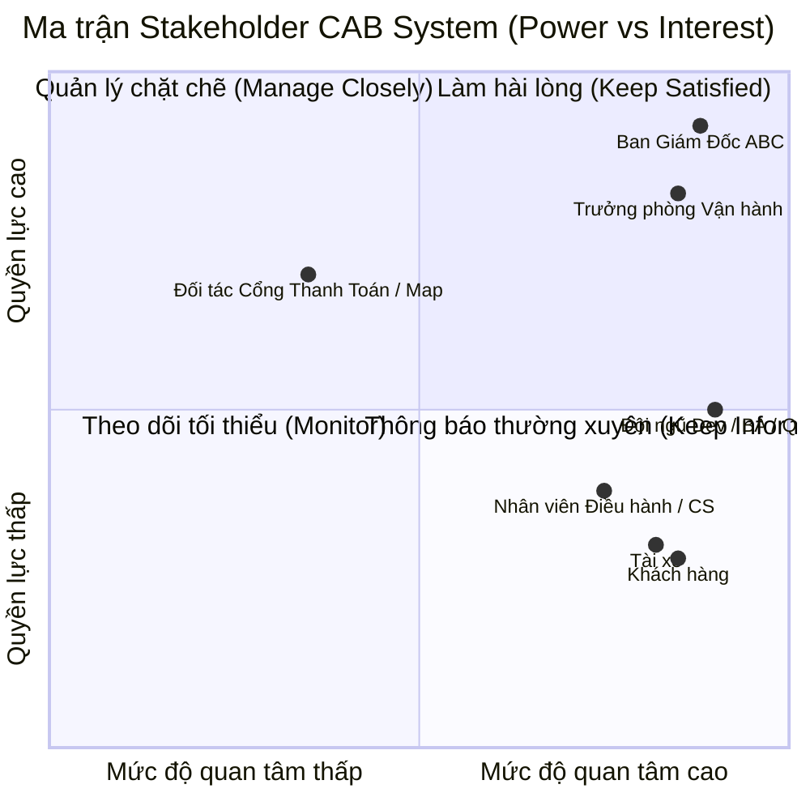
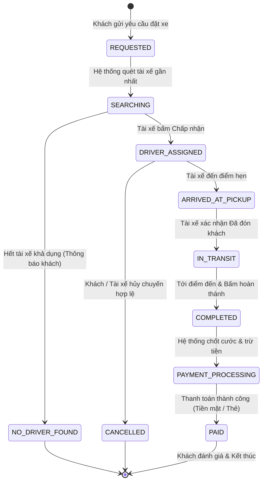
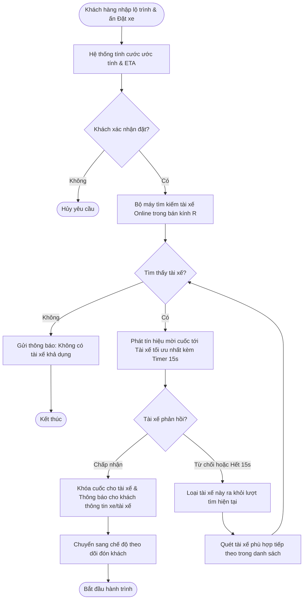
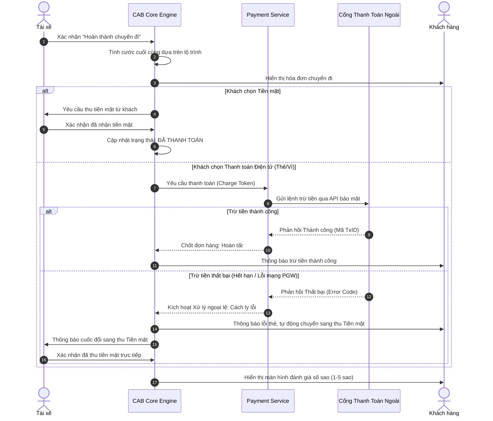
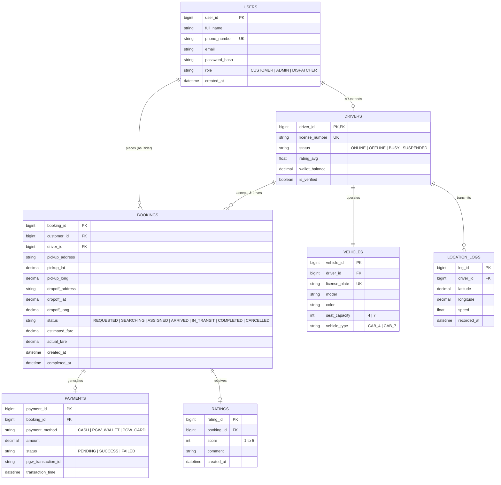
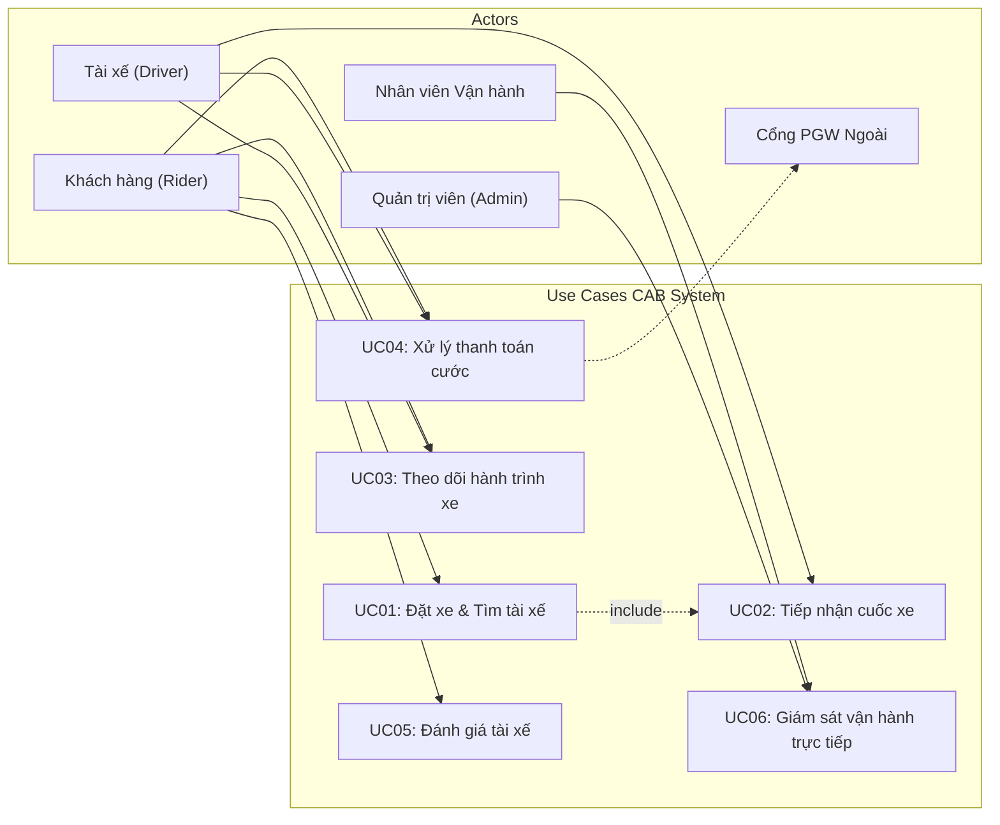
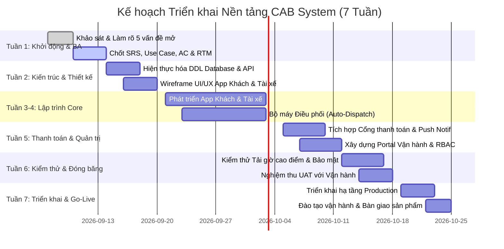

# BÁO CÁO ĐẶC TẢ YÊU CẦU PHẦN MỀM (SRS)
## ĐỀ TÀI: NỀN TẢNG ĐẶT XE TRỰC TUYẾN - CAB SYSTEM
- **Đơn vị đầu tư:** Công ty Cổ phần Vận tải ABC
- **Thời hạn triển khai:** 7 tuần (Triển khai phiên bản MVP)
- **Phương pháp luận:** Kỹ nghệ Yêu cầu Phần mềm (Software Requirements Engineering / Tiến trình BA chuẩn)

---

## BƯỚC 1: XÁC ĐỊNH PHẠM VI DỰ ÁN & MỤC TIÊU KINH DOANH (PROJECT SCOPE & OBJECTIVES)

### 1.1 Vấn đề tồn đọng của hiện trạng (Problem Statement)
- **Điều phối thủ công:** Tổng đài viên và ứng dụng sơ khai gán cuốc thủ công gây tắc nghẽn, chậm trễ trong giờ cao điểm.
- **Trải nghiệm thiếu minh bạch:** Khách hàng không theo dõi được vị trí tài xế theo thời gian thực (real-time tracking), không rõ thời gian dự kiến đón (ETA).
- **Quản lý dữ liệu phân tán:** Thông tin chuyến đi, cước phí và thanh toán chưa được đồng bộ tập trung, tiềm ẩn rủi ro sai lệch tài chính.
- **Khả năng mở rộng hạn chế:** Hệ thống cũ không hỗ trợ mở rộng thêm phương thức thanh toán, loại dịch vụ xe mới hoặc chịu tải đột biến.

### 1.2 Mục tiêu dự án (Business Objectives)
- Xây dựng nền tảng CAB System tự động hóa 100% quy trình: Đặt xe $
ightarrow$ Điều phối $
ightarrow$ Di chuyển $
ightarrow$ Tính cước $
ightarrow$ Thanh toán $
ightarrow$ Đánh giá.
- Rút ngắn thời gian gán tài xế xuống dưới 3 giây bằng thuật toán tự động.
- Triển khai và bàn giao phiên bản MVP hoạt động ổn định trong **7 tuần**.

---

## BƯỚC 2: PHÂN TÍCH CÁC BÊN LIÊN QUAN & MA TRẬN STAKEHOLDER (STAKEHOLDER MATRIX)

### 2.1 Bảng phân tích chi tiết Stakeholders
| Nhóm Stakeholder | Vai trò trong hệ thống | Kỳ vọng / Mục tiêu cốt lõi | Quyền lực (Power) | Mức độ quan tâm (Interest) |
| :--- | :--- | :--- | :---: | :---: |
| **Ban Giám Đốc ABC** | Chủ đầu tư (Sponsor) | Dự án kịp tiến độ 7 tuần, có khả năng mở rộng, báo cáo doanh thu & tỷ lệ hủy minh bạch. | Rất cao | Rất cao |
| **Trưởng phòng Vận hành** | Quản lý nghiệp vụ (Business Owner) | Giám sát toàn diện xe trên tuyến, phân quyền rõ ràng, hỗ trợ can thiệp cuốc lỗi tức thời. | Cao | Rất cao |
| **Khách hàng (Rider)** | Người dùng dịch vụ | Đặt xe nhanh chóng, cước phí rõ ràng, tài xế đón đúng giờ, an toàn. | Thấp | Rất cao |
| **Tài xế (Driver)** | Đối tác cung cấp dịch vụ | Nhận cuốc công bằng, giao diện 1-chạm an toàn khi lái xe, thu nhập rõ ràng. | Thấp | Rất cao |
| **Nhân viên Vận hành / CS** | Người vận hành tác nghiệp | Giao diện điều phối trực quan, tra cứu sự cố tức thì, thao tác nhanh. | Thấp | Cao |
| **Đối tác PGW / Map / Push** | Bên cung cấp hạ tầng thứ ba | Tích hợp đúng chuẩn API, bảo mật thông tin tài khoản thẻ theo chuẩn SLA. | Cao | Vừa |

### 2.2 Ma trận Phân tích Stakeholder (Mermaid Quadrant Chart)

---

## BƯỚC 3: XÁC ĐỊNH CÁC TÁC NHÂN HỆ THỐNG (SYSTEM ACTORS)

1. **Khách hàng (Customer / Rider):** Người đăng ký tài khoản, gửi yêu cầu đặt xe, theo dõi vị trí xe, thanh toán và đánh giá cuốc xe.
2. **Tài xế (Driver):** Đối tác nhận chuyến, cập nhật trạng thái di chuyển (Đã đến điểm đón $
ightarrow$ Đã đón khách $
ightarrow$ Hoàn thành), truyền tọa độ GPS định kỳ.
3. **Nhân viên Vận hành (Operations Staff):** Giám sát trạng thái xe trên bản đồ, hỗ trợ giải quyết sự cố, tra cứu lịch sử giao dịch.
4. **Quản trị viên (Admin):** Quản trị danh mục xe/tài xế, cấu hình biểu giá cước, quản lý phân quyền RBAC và trích xuất báo cáo kinh doanh.
5. **Cổng thanh toán bên ngoài (External Payment Gateway):** Hệ thống của bên thứ ba xử lý giao dịch trừ tiền thẻ/ví điện tử.
6. **Dịch vụ Bản đồ & Định vị (Map & Routing Service):** Cung cấp API tính lộ trình, gợi ý địa chỉ và ước tính khoảng cách/thời gian di chuyển.

---

## BƯỚC 4: TỔNG QUAN TIỀN ĐỀ VÀ DẪN DẮT (STAGE 4 ROADMAP OVERVIEW)
*Giai đoạn thiết lập chuẩn bị chuyển tiếp từ phạm vi tổng quan sang yêu cầu bài toán kinh doanh chi tiết.*

---

## BƯỚC 5: YÊU CẦU NGHIỆP VỤ (BUSINESS REQUIREMENTS)

- **BRQ-01 (Yêu cầu Đặt xe & Theo dõi):** Hệ thống phải cho phép khách hàng đặt xe theo loại dịch vụ mong muốn, nhận diện được trạng thái tìm kiếm, biết thông tin tài xế tiếp nhận và theo dõi di chuyển thời gian thực.
- **BRQ-02 (Yêu cầu Tự động phân công tài xế):** Hệ thống phải tự động quét, xếp hạng và gán tài xế gần nhất theo thuật toán tuần tự, đảm bảo không bỏ sót yêu cầu của khách hàng khi tài xế từ chối.
- **BRQ-03 (Yêu cầu Quản lý hành trình di chuyển):** Cung cấp cơ chế cập nhật trạng thái hành trình theo thời gian thực cho tài xế với thao tác 1-chạm, đồng bộ ngay lập tức sang ứng dụng của khách hàng.
- **BRQ-04 (Yêu cầu Tính cước & Thanh toán đa kênh):** Tự động tính cước minh bạch dựa trên dữ liệu hành trình thực tế, hỗ trợ linh hoạt cả tiền mặt và ví điện tử/thẻ ngân hàng.
- **BRQ-05 (Yêu cầu Thông báo sự kiện tức thời):** Tự động bắn thông báo đẩy (Push notification) tới đúng đối tượng tại từng mốc sự kiện quan trọng của cuốc xe.
- **BRQ-06 (Yêu cầu Giám sát vận hành & Báo cáo tổng hợp):** Cung cấp bảng điều khiển quản trị trung tâm để theo dõi các chuyến đi đang chạy, quản lý phương tiện/tài xế và trích xuất báo cáo doanh thu, tỷ lệ hoàn thành, tỷ lệ hủy.

---

## BƯỚC 6: MÔ HÌNH HÓA NGHIỆP VỤ (BUSINESS PROCESS MODELING)

### 6.1 Mô hình Vòng đời Trạng thái Cuốc xe (State Transition Diagram)

### 6.2 Sơ đồ Hoạt động Nghiệp vụ: Đặt xe & Tự động điều phối (Activity Diagram)

### 6.3 Sơ đồ Tuần tự Nghiệp vụ Thanh toán & Xử lý ngoại lệ (Sequence Diagram)

---

## BƯỚC 7: YÊU CẦU CHỨC NĂNG CHI TIẾT (FUNCTIONAL REQUIREMENTS - FR)

### 7.1 Phân hệ Khách hàng (Customer Subsystem - FR-CUS)
| Mã FR | Tên chức năng | Mô tả chi tiết kỹ thuật |
| :--- | :--- | :--- |
| **FR-CUS-01** | Đăng ký & Xác thực | Đăng ký tài khoản qua Số điện thoại, OTP xác thực SMS. Đăng nhập qua Mật khẩu/OTP. |
| **FR-CUS-02** | Chọn lộ trình di chuyển | Nhập điểm đón và điểm đến qua Map Autocomplete gợi ý địa chỉ và tọa độ GPS. |
| **FR-CUS-03** | Lựa chọn loại xe & Xem cước | Chọn hạng xe (4 chỗ, 7 chỗ). Hiển thị giá cước ước tính, khoảng cách (km) và ETA đón. |
| **FR-CUS-04** | Gửi yêu cầu Đặt xe | Khách ấn "Đặt xe", tạo bản ghi cuốc trạng thái `SEARCHING` đẩy sang máy chủ điều phối. |
| **FR-CUS-05** | Theo dõi tài xế thời gian thực | Hiển thị: Họ tên tài xế, ảnh, SĐT, biển số xe, dòng xe và vị trí xe di chuyển trên bản đồ. |
| **FR-CUS-06** | Hủy chuyến đi | Cho phép khách hủy chuyến trước khi tài xế đến điểm đón theo chính sách hủy. |
| **FR-CUS-07** | Lịch sử chuyến đi | Xem danh sách cuốc xe đã đi, hóa đơn chi tiết (mở cửa, quãng đường, thời gian) và lộ trình. |
| **FR-CUS-08** | Đánh giá & Phản hồi | Cho phép khách chấm điểm từ 1 đến 5 sao và để lại nhận xét sau khi hoàn tất cuốc. |

### 7.2 Phân hệ Tài xế (Driver Subsystem - FR-DRI)
| Mã FR | Tên chức năng | Mô tả chi tiết kỹ thuật |
| :--- | :--- | :--- |
| **FR-DRI-01** | Đăng ký & Quản lý hồ sơ | Đăng ký hồ sơ, tải lên bằng lái, đăng kiểm xe; chờ phê duyệt từ Admin. |
| **FR-DRI-02** | Bật/Tắt trạng thái làm việc | Nút gạt chuyển đổi trạng thái giữa `Online` (sẵn sàng) và `Offline` (nghỉ ngơi). |
| **FR-DRI-03** | Gửi tọa độ GPS thời gian thực | Chạy nền định kỳ 3-5 giây/lần gửi tọa độ vị trí hiện tại về Location Service. |
| **FR-DRI-04** | Tiếp nhận thông báo cuốc xe | Nhận pop-up thông báo: Điểm đón, đến, cước ước tính, cự ly đón, kèm nút Chấp nhận/Từ chối và bộ đếm ngược 15s. |
| **FR-DRI-05** | Cập nhật tiến độ cuốc xe | Giao diện 1-chạm cập nhật: (1) Đã đến điểm đón $
ightarrow$ (2) Đã đón khách $
ightarrow$ (3) Hoàn thành chuyến. |
| **FR-DRI-06** | Xác nhận thanh toán tiền mặt | Hiển thị số tiền cần thu từ khách và nút xác nhận "Đã nhận đủ tiền mặt". |

### 7.3 Phân hệ Điều phối & Thuật toán tìm xe (Matching & Dispatching - FR-DIS)
| Mã FR | Tên chức năng | Mô tả chi tiết kỹ thuật |
| :--- | :--- | :--- |
| **FR-DIS-01** | Quét tài xế lân cận | Truy vấn tài xế trong bán kính $R$ (3-5km): Đang Online, Rảnh rỗi (`Idle`), đúng loại xe. |
| **FR-DIS-02** | Xếp hạng ưu tiên tài xế | Sắp xếp theo: Khoảng cách tiếp cận ngắn nhất + Điểm đánh giá (Rating) cao nhất. |
| **FR-DIS-03** | Chuyển tiếp cuốc xe tự động | Gửi lời mời tới top 1. Nếu từ chối hoặc hết 15s (Timeout), tự động loại trừ và đẩy sang top 2. |
| **FR-DIS-04** | Xử lý khi không có tài xế | Quét hết danh sách hoặc quá 60s không có ai nhận, chuyển sang `NO_DRIVER_FOUND` và báo khách. |

### 7.4 Phân hệ Tính cước & Thanh toán (Fare & Payment - FR-PAY)
| Mã FR | Tên chức năng | Mô tả chi tiết kỹ thuật |
| :--- | :--- | :--- |
| **FR-PAY-01** | Công thức tính cước tự động | `Tổng tiền = Cước mở cửa + (Khoảng cách thực tế x Đơn giá/km) + (Thời gian chạy x Đơn giá/phút)`. |
| **FR-PAY-02** | Tích hợp Cổng thanh toán (PGW) | Kết nối API cổng thanh toán trừ tiền tự động bằng Token định danh. |
| **FR-PAY-03** | Bảo mật không lưu thông tin thẻ | Không lưu PAN/CVV vào CSDL nội bộ; chỉ lưu mã `Payment_Token_ID` do PGW cấp. |
| **FR-PAY-04** | Cơ chế cách ly lỗi thanh toán | Nếu PGW báo lỗi hoặc timeout: Lập tức chuyển sang thu Tiền mặt, gửi thông báo cho tài xế thu trực tiếp. |

### 7.5 Phân hệ Thông báo Đa kênh (Notification Subsystem - FR-NOT)
| Mã FR | Tên chức năng | Mô tả chi tiết kỹ thuật |
| :--- | :--- | :--- |
| **FR-NOT-01** | Bắn Push Notification tự động | Gửi thông báo đẩy: Đã tìm thấy xe, Xe đã đến, Đang di chuyển, Hoàn thành, Trừ tiền. |
| **FR-NOT-02** | Kiến trúc mở rộng kênh thông báo | Adapter Pattern cho phép cắm thêm kênh SMS, Zalo ZNS hoặc WhatsApp trong tương lai. |

### 7.6 Phân hệ Quản trị & Vận hành (Operations & Admin Portal - FR-OPS)
| Mã FR | Tên chức năng | Mô tả chi tiết kỹ thuật |
| :--- | :--- | :--- |
| **FR-OPS-01** | Giám sát cuốc xe trực tiếp | Bản đồ tương tác hiển thị xe đang hoạt động, danh sách chuyến thời gian thực (Chờ, Chạy, Lỗi). |
| **FR-OPS-02** | Quản lý Tài khoản & Phương tiện | Phê duyệt hồ sơ tài xế mới, khóa tạm thời tài khoản vi phạm, quản lý kiểm định xe. |
| **FR-OPS-03** | Phân quyền truy cập theo vai trò (RBAC) | Cấu hình quyền: (1) `Admin` toàn quyền, (2) `Dispatcher` giám sát/xử lý cuốc, (3) `Support` tra cứu khiếu nại. |
| **FR-OPS-04** | Báo cáo & Thống kê kinh doanh | Trích xuất báo cáo: Doanh thu, Tổng chuyến, Tỷ lệ hoàn thành, Tỷ lệ hủy, Hiệu suất tài xế. |

---

## BƯỚC 8: QUY TẮC NGHIỆP VỤ & CÁC TRƯỜNG HỢP NGOẠI LỆ (BUSINESS RULES & EXCEPTION HANDLING)

| Mã BR | Quy tắc nghiệp vụ chuẩn (Business Rule) | Tình huống ngoại lệ (Exception Scenario) | Cơ chế xử lý ngoại lệ của Hệ thống (Exception Handling) |
| :--- | :--- | :--- | :--- |
| **BR-01** | **Điều kiện nhận việc:** Tài xế chỉ nhận cuốc mới khi Online, tài khoản đã phê duyệt và không trong cuốc khác (`Active Trip = False`). | Tài xế cố tình nhận cuốc khi đang chở khách hoặc tài khoản bị khóa lúc đang bật Online. | Hệ thống chặn gọi API dispatch; tự động chuyển trạng thái sang `Suspended`/`Busy` và gửi cảnh báo về app tài xế. |
| **BR-02** | **Phân phối tuần tự & Timeout:** Gửi cuốc tới 01 tài xế tối ưu nhất; tài xế có 15 giây để bấm Chấp nhận. | - Tài xế ấn "Từ chối". - Tài xế không bấm gì hết 15 giây. - Mất kết nối mạng đột ngột. | Áp dụng **Failover Dispatch**: Tự động loại tài xế này ra khỏi lượt tìm hiện tại, giữ nguyên yêu cầu của khách và bắn lời mời sang tài xế tiếp theo. |
| **BR-03** | **Cạn kiệt tài xế:** Quét bán kính 5km để tìm xe. | Hết danh sách hoặc sau 60 giây không có ai nhận cuốc. | Chuyển trạng thái sang `NO_DRIVER_FOUND`, dừng bộ đếm, gửi push notification xin lỗi khách và gợi ý thử lại. |
| **BR-04** | **Thanh toán Điện tử thất bại:** Trừ tiền qua PGW bằng Token định danh. Không lưu PAN/CVV. | PGW báo lỗi (thẻ hết tiền, bị khóa, lỗi mạng cổng thanh toán). | **Cách ly lỗi (Fault Isolation):** Không hủy chuyến, ghi nhận mã lỗi, tự động chuyển phương thức sang `Tiền mặt`, thông báo cho tài xế thu trực tiếp. |
| **BR-05** | **Hoàn thành cuốc hợp lệ:** Chuyến chỉ đóng khi xe cách điểm đến dưới 150m. | Khách yêu cầu xuống xe sớm hoặc tài xế quên bấm hoàn thành sau khi khách xuống. | Cho phép tài xế chọn "Khách xuống điểm khác"; yêu cầu nhập lý do và hệ thống tính lại cước theo tọa độ GPS thực tế lúc dừng. |
| **BR-06** | **Mất kết nối GPS ngoại tuyến:** Tài xế gửi định vị định kỳ 3-5s/lần. | Xe vào hầm hoặc vùng lõm sóng viễn thông mất sóng 4G/GPS. | Kích hoạt **Offline Cache**: lưu tọa độ vào bộ nhớ tạm điện thoại. Khi có mạng lại, tự động gửi gói đồng bộ (Batch Sync) để vẽ lại lộ trình và tính tiền. |
| **BR-07** | **Chính sách hủy chuyến:** Khách hủy miễn phí trong 2 phút đầu sau khi xe nhận. | Khách hủy sau khi xe chạy hơn 5 phút hoặc tài xế tới điểm đón đợi quá 5 phút. | Áp dụng phí phạt hủy chuyến (Cancellation Fee), ghi nợ tài khoản khách lần sau và cộng hỗ trợ xăng xe vào ví cọc tài xế. |

---

## BƯỚC 9: YÊU CẦU PHI CHỨC NĂNG (NON-FUNCTIONAL REQUIREMENTS - NFR)

### 9.1 Hiệu năng & Khả năng mở rộng (Performance & Scalability)
- **NFR-01 (Thời gian phản hồi):** 95% API thông thường phản hồi dưới 500ms. Thời gian phát cuốc xe tới tài xế đầu tiên không quá 3 giây.
- **NFR-02 (Tần suất đồng bộ GPS):** Tọa độ GPS gửi lên server 3-5 giây/lần; độ trễ hiển thị vị trí trên màn hình khách không quá 2 giây.
- **NFR-03 (Chịu tải cao điểm):** Tự động co giãn theo chiều ngang (Horizontal Auto-scaling) khi lượng yêu cầu tăng gấp 5 lần vào giờ cao điểm, mưa bão mà không sập dịch vụ điều phối lõi.

### 9.2 Độ tin cậy & Cách ly lỗi (Availability & Fault Tolerance)
- **NFR-04 (Tính sẵn sàng):** Độ khả dụng toàn hệ thống đạt tối thiểu **99.5%**.
- **NFR-05 (Cách ly sự cố - Fault Isolation):** Lỗi của các phân hệ phụ trợ (Cổng thanh toán sập, Push Notification nghẽn) tuyệt đối không làm gián đoạn quy trình đặt xe và chạy chuyến cơ bản.

### 9.3 Bảo mật & Tuân thủ (Security & Privacy)
- **NFR-06 (Mã hóa & Xác thực):** Mã hóa HTTPS/TLS 1.3 cho toàn bộ kết nối. Xác thực người dùng bằng JWT Token có thời hạn kèm Refresh Token bảo mật.
- **NFR-07 (Bảo vệ dữ liệu nhạy cảm):** Số điện thoại khách hàng được làm mờ (Masking). Không lưu PAN/CVV thẻ ngân hàng trong CSDL nội bộ.
- **NFR-08 (Nhật ký kiểm toán):** Ghi log bất biến (Immutable Audit Log) cho toàn bộ thao tác quản trị nhạy cảm (đổi giá cước, can thiệp trạng thái chuyến, khóa tài khoản).

---

## BƯỚC 10: XÁC ĐỊNH THỰC THỂ DỮ LIỆU & THIẾT KẾ ERD (ENTITY IDENTIFICATION & ERD)

### 10.1 Danh mục các Thực thể Dữ liệu (Entity Identification)
1. **USERS (Người dùng):** Tài khoản chung (Khách hàng, Nhân viên, Quản trị viên).
2. **DRIVERS (Tài xế):** Mở rộng từ Users, lưu bằng lái, trạng thái Online/Offline, điểm đánh giá trung bình.
3. **VEHICLES (Phương tiện):** Lưu biển số, loại xe (4/7 chỗ), kiểm định.
4. **BOOKINGS / RIDES (Chuyến đi):** Điểm đón, điểm đến, lộ trình, cước ước tính & thực tế, trạng thái chuyến.
5. **LOCATION_LOGS (Nhật ký vị trí):** Chuỗi tọa độ GPS (Lat, Long, Speed, Time) của xe.
6. **PAYMENTS (Thanh toán):** Phương thức (Tiền mặt/PGW), Mã giao dịch TxID, Trạng thái.
7. **RATINGS (Đánh giá):** Điểm đánh giá (1-5 sao) và nhận xét của khách.

### 10.2 Sơ đồ Thực thể - Mối quan hệ (Entity Relationship Diagram - ERD)

---

## BƯỚC 11: THIẾT KẾ USE CASE CHI TIẾT (DETAILED USE CASE SPECIFICATIONS)

### 11.1 Sơ đồ Phân rã Use Case Hệ thống (System Use Case Diagram)

### 11.2 Đặc tả Use Case Cốt lõi: UC01 - Đặt xe & Tìm tài xế tự động
- **Mã Use Case:** `UC01`
- **Tên Use Case:** Đặt xe và Tự động điều phối tài xế (Book Ride & Auto Dispatch).
- **Tác nhân chính:** Khách hàng (Rider), Tài xế (Driver), Hệ thống lõi (Core Engine).
- **Tiền điều kiện (Pre-conditions):** Khách hàng đã đăng nhập tài khoản hợp lệ, bật định vị GPS trên điện thoại.
- **Hậu điều kiện (Post-conditions):** Hệ thống gán thành công 01 tài xế cho cuốc xe, trạng thái cuốc đổi sang `ASSIGNED`, hoặc trả về `NO_DRIVER_FOUND` nếu cạn xe.
- **Luồng sự kiện chính (Basic Flow):**
  1. Khách hàng nhập điểm đón và điểm đến.
  2. Hệ thống tính lộ trình, khoảng cách, cước ước tính và hiển thị danh sách loại xe.
  3. Khách chọn loại xe (4 chỗ / 7 chỗ), chọn phương thức thanh toán và bấm "Xác nhận đặt xe".
  4. Hệ thống chuyển trạng thái cuốc sang `SEARCHING` và hiển thị màn hình tìm tài xế.
  5. Hệ thống quét các tài xế thỏa mãn điều kiện sẵn sàng trong bán kính 3-5km, xếp hạng theo độ gần và điểm đánh giá.
  6. Hệ thống gửi lời mời nhận cuốc kèm đếm ngược 15 giây tới tài xế xếp hạng cao nhất.
  7. Tài xế bấm "Chấp nhận" trong vòng 15 giây.
  8. Hệ thống khóa cuốc xe, chuyển trạng thái sang `ASSIGNED`, hiển thị thông tin tài xế và biển số xe cho khách hàng.
- **Luồng sự kiện nhánh / Ngoại lệ (Alternative & Exception Flows):**
  - *4a. Tài xế từ chối hoặc quá 15 giây không bấm:* Hệ thống kích hoạt BR-02, loại tài xế này ra khỏi lượt tìm kiếm hiện tại và tự động gửi lời mời tới tài xế ưu tiên kế tiếp.
  - *4b. Không tìm thấy tài xế nào khả dụng sau 60 giây:* Kích hoạt BR-03, chuyển trạng thái cuốc sang `NO_DRIVER_FOUND`, thông báo cho khách và kết thúc Use Case.
  - *4c. Khách hàng bấm "Hủy tìm kiếm":* Hệ thống dừng chu kỳ quét, đổi trạng thái sang `CANCELLED` và trả khách về màn hình chính.

### 11.3 Đặc tả Use Case Cốt lõi: UC04 - Xử lý thanh toán cước chuyến đi
- **Mã Use Case:** `UC04`
- **Tên Use Case:** Xử lý thanh toán cước chuyến đi (Process Fare Payment).
- **Tác nhân chính:** Tài xế (Driver), Khách hàng (Rider), Cổng thanh toán (PGW).
- **Tiền điều kiện:** Chuyến đi đã hoàn tất, xe đã đến điểm trả khách và tài xế bấm "Hoàn thành chuyến".
- **Hậu điều kiện:** Cuốc xe chuyển sang trạng thái `PAID`, hóa đơn được lưu vào lịch sử giao dịch.
- **Luồng sự kiện chính (Thanh toán điện tử thành công):**
  1. Tài xế bấm "Hoàn thành chuyến".
  2. Hệ thống chốt cước thực tế và gửi yêu cầu trừ tiền kèm Token tới Cổng thanh toán PGW.
  3. Cổng PGW xử lý trừ tiền và trả về mã giao dịch `TxID` thành công.
  4. Hệ thống cập nhật trạng thái chuyến sang `PAID`, lưu bản ghi vào bảng `PAYMENTS`.
  5. Hệ thống gửi thông báo trừ tiền thành công cho khách hàng kèm hóa đơn tóm tắt.
  6. Hệ thống hiển thị thông báo đã nhận tiền ví cho tài xế.
- **Luồng ngoại lệ (Cổng thanh toán lỗi / Thẻ hết tiền - Exception Flow):**
  - *3a. PGW trả về mã lỗi hoặc timeout sau 10 giây:* Kích hoạt BR-04, hệ thống cách ly lỗi bằng cách tự động chuyển phương thức thanh toán sang `Tiền mặt`.
  - *3b. Màn hình app khách hiển thị thông báo:* "Thanh toán thẻ không thành công, vui lòng gửi tiền mặt cho tài xế".
  - *3c. Màn hình app tài xế hiển thị:* "Thu tiền mặt: [Số tiền] VNĐ".
  - *3d. Tài xế nhận tiền mặt và bấm xác nhận "Đã thu tiền":* Hệ thống đóng cuốc và ghi nhận hoàn tất.

---

## BƯỚC 12: TIÊU CHÍ CHẤP NHẬN KIỂM THỬ (ACCEPTANCE CRITERIA - AC)

### 12.1 Tiêu chí chấp nhận cho Phân hệ Đặt xe & Điều phối (Auto-Dispatch)
- **AC-01: Ước tính cước phí minh bạch**
  - **Given (Cho trước):** Khách hàng đã chọn điểm đón tại "Quận 1" và điểm đến tại "Sân bay Tân Sơn Nhất".
  - **When (Khi):** Khách hàng nhấn chọn loại xe "CAB 4 chỗ".
  - **Then (Thì):** Hệ thống phải hiển thị giá cước ước tính (sai số dưới 5%), quãng đường dự kiến (km) và thời gian tài xế có thể đến đón (ETA) trong vòng dưới 1 giây.

- **AC-02: Cơ chế điều phối tuần tự (Sequential Failover Dispatch)**
  - **Given:** Khách hàng đã ấn "Đặt xe" và hệ thống phát tín hiệu cuốc xe tới Tài xế A (gần nhất).
  - **When:** Tài xế A bấm nút "Từ chối" hoặc để bộ đếm ngược 15 giây kết thúc mà không phản hồi.
  - **Then:** Hệ thống phải tự động chuyển lời mời cuốc xe sang Tài xế B (gần thứ nhì) trong vòng 1 giây mà không hiển thị thông báo lỗi hoặc bắt khách hàng phải đặt lại xe.

- **AC-03: Xử lý khi cạn kiệt tài xế (No Driver Found)**
  - **Given:** Không có bất kỳ tài xế Online nào trong bán kính 5km nhận chuyến sau 60 giây quét.
  - **When:** Bộ đếm thời gian tìm kiếm tổng kết thúc.
  - **Then:** Hệ thống phải dừng quét, chuyển trạng thái sang `NO_DRIVER_FOUND`, thông báo rõ ràng cho khách: "Rất tiếc hiện tại quanh bạn không có tài xế nhận chuyến, vui lòng thử lại sau ít phút" và mở lại nút "Thử lại".

### 12.2 Tiêu chí chấp nhận cho Phân hệ Cập nhật vị trí & Hành trình
- **AC-04: Cập nhật vị trí xe thời gian thực**
  - **Given:** Tài xế đang trong trạng thái `ASSIGNED` và di chuyển đến điểm đón.
  - **When:** Thiết bị tài xế truyền tọa độ GPS định kỳ 3 giây/lần.
  - **Then:** Bản đồ trên ứng dụng của khách hàng phải hiển thị icon xe di chuyển mượt mà, độ trễ cập nhật vị trí so với thực tế không quá 2 giây.

- **AC-05: Lưu đệm GPS khi mất sóng (Offline Cache)**
  - **Given:** Xe đi vào đường hầm mất sóng 4G/GPS trong 3 phút.
  - **When:** Điện thoại có sóng mạng di động trở lại.
  - **Then:** Ứng dụng tài xế phải tự động gửi toàn bộ gói tọa độ đã lưu trong bộ nhớ đệm lên máy chủ, vẽ lại đầy đủ cung đường đã đi và tính cước chính xác, không làm sai lệch số km.

### 12.3 Tiêu chí chấp nhận cho Phân hệ Thanh toán & Cách ly lỗi (Payment Fault Tolerance)
- **AC-06: Trừ tiền tự động qua Cổng thanh toán (PGW)**
  - **Given:** Khách hàng đăng ký thẻ thanh toán thành công và chọn hình thức thanh toán trực tuyến.
  - **When:** Chuyến đi kết thúc với tổng cước là 120.000 VNĐ.
  - **Then:** Hệ thống tự động gọi API PGW trừ đúng 120.000 VNĐ, không yêu cầu khách nhập lại số thẻ hay mã OTP, gửi hóa đơn điện tử về app trong vòng 3 giây.

- **AC-07: Tự động chuyển hình thức tiền mặt khi PGW gặp sự cố**
  - **Given:** Cổng thanh toán bên ngoài bị sự cố gián đoạn (timeout hoặc HTTP 500).
  - **When:** Hệ thống gửi lệnh trừ tiền cước chuyến đi.
  - **Then:** Hệ thống không được báo lỗi sập cuốc, phải tự động đổi phương thức thanh toán sang `Tiền mặt`, hiển thị số tiền cần thu trên màn hình tài xế và thông báo chuyển hình thức thanh toán trên màn hình khách hàng.

### 12.4 Tiêu chí chấp nhận cho Phân hệ Quản trị & Vận hành (Admin & Ops Portal)
- **AC-08: Phân quyền truy cập an toàn (RBAC Compliance)**
  - **Given:** Người dùng đăng nhập vào Portal quản trị với vai trò là nhân viên hỗ trợ (`Support`).
  - **When:** Nhân viên truy cập vào module cấu hình biểu giá cước hoặc module duyệt rút tiền tài xế.
  - **Then:** Hệ thống phải từ chối truy cập (HTTP 403 Forbidden), ghi nhận nhật ký vi phạm và chỉ cho phép tài khoản có vai trò `Admin` thực hiện thao tác này.

---

## BƯỚC 13: MA TRẬN TRUY VẾT YÊU CẦU (REQUIREMENTS TRACEABILITY MATRIX - RTM)
*(Bảng ma trận truy vết chứng minh tính toàn vẹn của đồ án: kết nối xuyên suốt từ Mục tiêu kinh doanh $
ightarrow$ Yêu cầu nghiệp vụ $
ightarrow$ Chức năng $
ightarrow$ Quy tắc/Ngoại lệ $
ightarrow$ Thực thể CSDL $
ightarrow$ Use Case $
ightarrow$ Tiêu chí kiểm thử)*

| Business Req (Bước 5) | Functional Req (Bước 7) | Business Rule & Ngoại lệ (Bước 8) | Thực thể ERD (Bước 10) | Use Case (Bước 11) | Acceptance Criteria (Bước 12) |
| :--- | :--- | :--- | :--- | :--- | :--- |
| **BRQ-01** (Đặt xe & Theo dõi) | FR-CUS-02, FR-CUS-03, FR-CUS-04, FR-CUS-05 | BR-06 (Mất GPS ngoại tuyến) | `BOOKINGS`, `LOCATION_LOGS` | `UC01`, `UC03` | **AC-01, AC-04, AC-05** |
| **BRQ-02** (Tự động gán tài xế) | FR-DIS-01, FR-DIS-02, FR-DIS-03, FR-DIS-04 | BR-01 (Điều kiện Online), BR-02 (Failover 15s), BR-03 (Cạn xe) | `DRIVERS`, `BOOKINGS` | `UC01`, `UC02` | **AC-02, AC-03** |
| **BRQ-03** (Quản lý di chuyển) | FR-DRI-02, FR-DRI-03, FR-DRI-04, FR-DRI-05 | BR-05 (Hoàn thành cuốc), BR-07 (Chính sách hủy) | `DRIVERS`, `VEHICLES`, `LOCATION_LOGS` | `UC02`, `UC03` | **AC-04, AC-05** |
| **BRQ-04** (Tính cước & Thanh toán) | FR-PAY-01, FR-PAY-02, FR-PAY-03, FR-PAY-04, FR-DRI-06 | BR-04 (Cách ly lỗi PGW) | `BOOKINGS`, `PAYMENTS` | `UC04` | **AC-06, AC-07** |
| **BRQ-05** (Thông báo sự kiện) | FR-NOT-01, FR-NOT-02 | BR-02, BR-03, BR-04 (Bắn push khi chuyển trạng thái) | `USERS`, `BOOKINGS` | `UC01`, `UC04` | **AC-02, AC-07** |
| **BRQ-06** (Giám sát & Báo cáo) | FR-OPS-01, FR-OPS-02, FR-OPS-03, FR-OPS-04 | NFR-08 (Audit Trail phân quyền) | `USERS`, `DRIVERS`, `BOOKINGS`, `PAYMENTS` | `UC06` | **AC-08** |

---

## BƯỚC 14: DANH MỤC VẤN ĐỀ CẦN LÀM RÕ VỚI KHÁCH HÀNG (OPEN ISSUES FOR BA)

Trong Tuần 1, Business Analyst cần làm việc với Lãnh đạo Công ty ABC để thống nhất các nội dung sau:
1. **Chi tiết cấu trúc cước:** Công thức cước cố định 2km đầu là bao nhiêu? Đơn giá/km và phụ phí đêm/giờ cao điểm được cấu hình động ra sao?
2. **Quy định phạt tài xế:** Tài xế không phản hồi/từ chối bao nhiêu cuốc liên tiếp thì bị hạ điểm uy tín hoặc khóa tài khoản tạm thời?
3. **Chính sách hủy chuyến:** Thời gian hủy miễn phí là bao nhiêu phút sau khi xe nhận? Phí hủy cuốc (nếu có) được tính và trừ vào tài khoản khách bằng cách nào?
4. **Xử lý mất kết nối mạng:** Cơ chế lưu đệm tọa độ ngoại tuyến trên thiết bị tài xế và gửi bù tọa độ khi có lại sóng 4G.
5. **Thời hạn lưu vết dữ liệu:** Quy định lưu trữ tọa độ GPS chi tiết (đề xuất 30 ngày) và dữ liệu kế toán/giao dịch (đề xuất tối thiểu 5 năm).

---

## BƯỚC 15: KẾ HOẠCH BÀN GIAO 7 TUẦN (7-WEEK GANTT ROADMAP)

