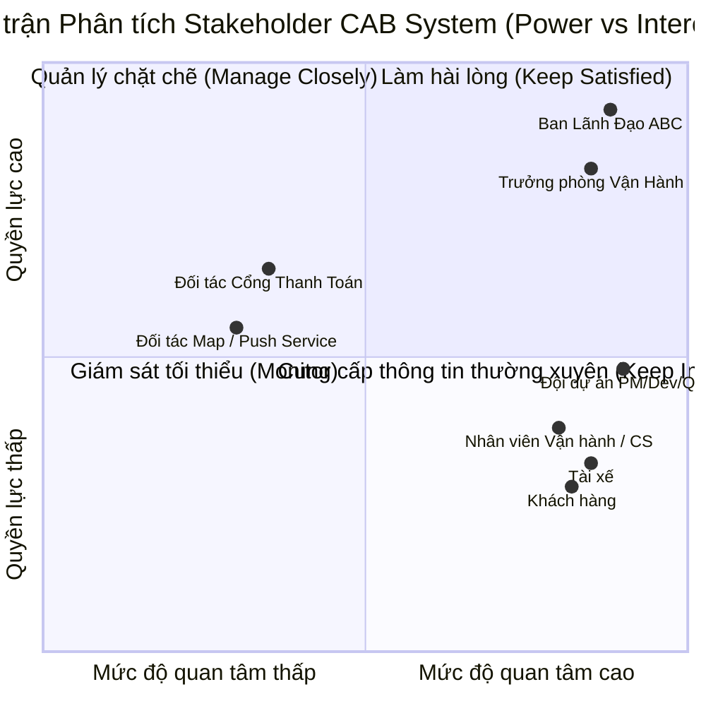
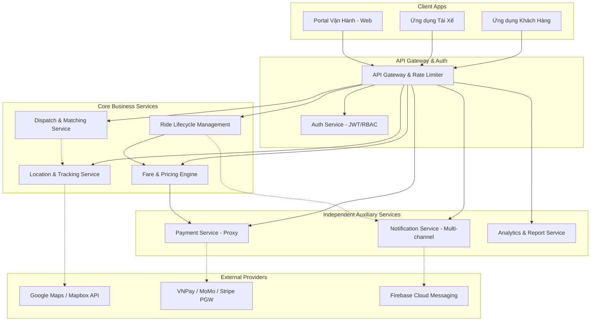
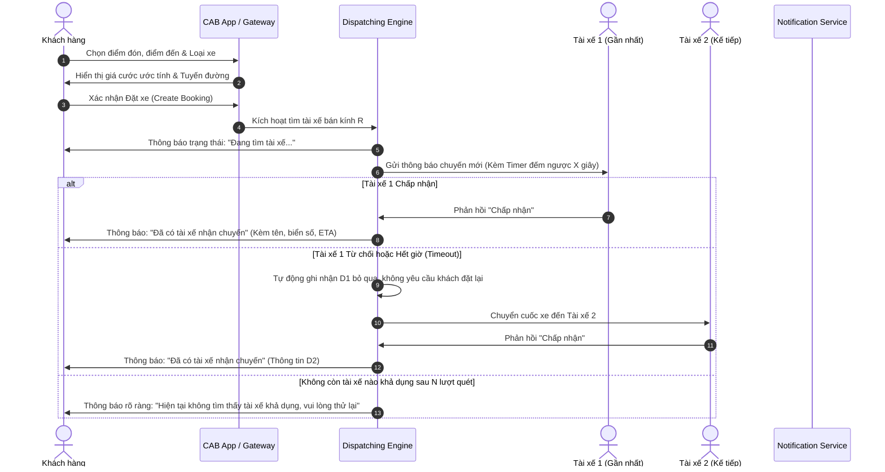
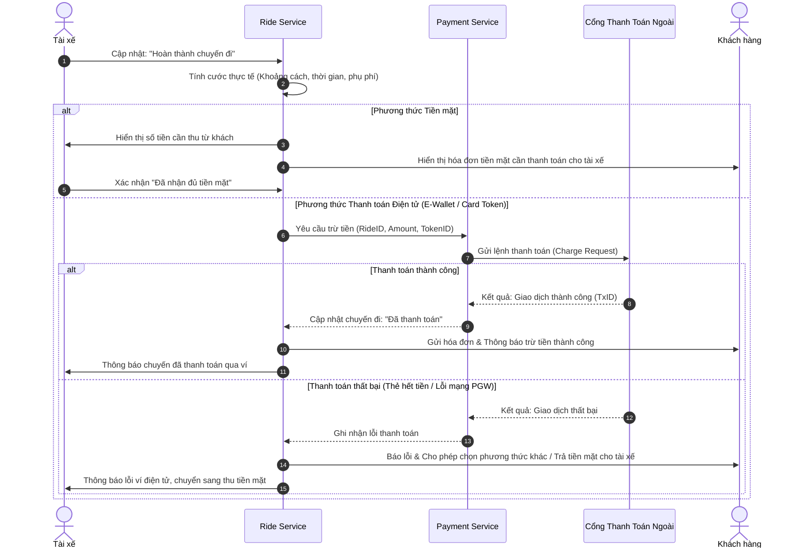
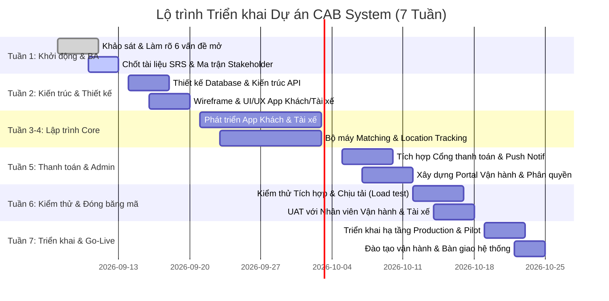

# TÀI LIỆU ĐẶC TẢ YÊU CẦU PHẦN MỀM (SRS)
## DỰ ÁN: NỀN TẢNG ĐẶT XE TRỰC TUYẾN - CAB SYSTEM
**Khách hàng:** Công ty Cổ phần Vận tải ABC  
**Thời hạn triển khai:** 7 tuần  
**Phiên bản tài liệu:** v1.0  
**Tình trạng:** Chờ phê duyệt (Draft for Review)  

---

## 1. GIỚI THIỆU (INTRODUCTION)

### 1.1 Mục đích (Purpose)
Tài liệu Đặc tả Yêu cầu Phần mềm (Software Requirements Specification - SRS) này mô tả toàn diện các yêu cầu nghiệp vụ, yêu cầu chức năng, phi chức năng, kiến trúc logic và các ràng buộc vận hành cho hệ thống **CAB System**. Tài liệu phục vụ làm cơ sở kỹ thuật và cam kết nghiệp vụ giữa Khách hàng (Công ty ABC), Đội ngũ Phân tích nghiệp vụ (BA), Kiến trúc sư giải pháp (SA), Lập trình viên (Dev), Kiểm thử viên (QA/QC) và Đơn vị Vận hành trong kế hoạch bàn giao 7 tuần.

### 1.2 Phạm vi sản phẩm (Project Scope)
- **Mục tiêu:** Thay thế hệ thống tiếp nhận thủ công (tổng đài rời rạc, app đơn giản) bằng một nền tảng đặt xe tự động hóa khép kín: từ nhận yêu cầu, phân bổ tài xế tự động, định vị thời gian thực, quản lý cước phí/thanh toán điện tử, thông báo đa kênh, đến cổng quản trị tập trung (Operations Portal).
- **Phạm vi trong dự án (In-Scope - 7 tuần MVP):**
  - Ứng dụng Khách hàng (Mobile/Web): Đặt xe, theo dõi tài xế thời gian thực, ước tính cước, lịch sử chuyến đi, đánh giá tài xế.
  - Ứng dụng Tài xế (Mobile): Tiếp nhận cuốc xe tự động, bật/tắt trạng thái nhận việc, cập nhật trạng thái di chuyển, định vị GPS.
  - Bộ máy phân phối tự động (Automated Matching & Dispatch Engine): Tìm và chỉ định tài xế gần nhất theo thuật toán xoay vòng khi tài xế từ chối hoặc hết giờ phản hồi.
  - Tích hợp cổng thanh toán bên ngoài (Payment Gateway) an toàn không lưu thẻ nhạy cảm + thanh toán tiền mặt.
  - Cổng thông tin vận hành & báo cáo (Admin/Operations Web Portal): Giám sát cuốc xe trực tiếp, quản lý tài xế/phương tiện, phân quyền RBAC, báo cáo doanh thu & tỷ lệ hủy.
  - Hệ thống thông báo thời gian thực (Push notification/In-app).
- **Phạm vi ngoài dự án (Out-of-Scope - Các giai đoạn sau):**
  - Tự xây dựng cổng xử lý thẻ tín dụng nội bộ đạt chuẩn PCI-DSS Level 1.
  - Thuật toán định giá động (Surge Pricing) phức tạp theo Machine Learning thời gian thực.
  - Đặt xe theo lịch hẹn trước nhiều ngày (Schedule Booking) hoặc đi chung xe (Carpooling).

### 1.3 Định nghĩa & Từ viết tắt (Definitions & Acronyms)
| Thuật ngữ | Định nghĩa |
| :--- | :--- |
| **CAB** | Chauffeur / Car Booking System - Nền tảng đặt xe công nghệ |
| **BA** | Business Analyst - Chuyên viên Phân tích nghiệp vụ |
| **RBAC** | Role-Based Access Control - Quản lý truy cập dựa trên vai trò |
| **ETA** | Estimated Time of Arrival - Thời gian dự kiến xe đến điểm đón |
| **PGW** | Payment Gateway - Cổng thanh toán điện tử của bên thứ ba |
| **PII** | Personally Identifiable Information - Dữ liệu định danh cá nhân |
| **GPS** | Global Positioning System - Hệ thống định vị toàn cầu |

---

## 2. PHÂN TÍCH VÀ MA TRẬN STAKEHOLDER (STAKEHOLDER ANALYSIS & MATRIX)

### 2.1 Danh sách Stakeholders (Xác định các bên liên quan)
1. **Ban Lãnh đạo Công ty ABC (Sponsor / Executive Board):** Kỳ vọng hệ thống ổn định, chịu tải cao, mở rộng trong tương lai, báo cáo chỉ số kinh doanh rõ ràng.
2. **Bộ phận Vận hành & Chăm sóc khách hàng (Operations & CS Team):** Cần giao diện trực quan để giám sát tài xế/chuyến đi, can thiệp sự cố tức thời, phân quyền an toàn.
3. **Khách hàng đặt xe (Passengers / Riders):** Muốn trải nghiệm đặt xe mượt mà, minh bạch giá cước, tài xế đến đúng giờ, theo dõi vị trí trực quan.
4. **Tài xế đối tác (Drivers):** Cần nhận thông báo cuốc xe công bằng, nhanh chóng, giao diện dễ thao tác khi đang lái xe, thống kê thu nhập chính xác.
5. **Đối tác thứ ba (Payment Gateway, SMS/Push Service, Map Provider):** Cung cấp hạ tầng thanh toán, bản đồ, định vị và hạ tầng gửi tin nhắn.
6. **Đội ngũ Phát triển & Vận hành CNTT (Project Team - PM, BA, Dev, QA, DevOps):** Cần yêu cầu rõ ràng để hoàn thành và bàn giao hệ thống trong 7 tuần.

### 2.2 Ma trận Phân tích Stakeholder (Power - Interest Matrix)
Ma trận phân loại các bên liên quan dựa trên hai chiều: **Quyền lực/Ảnh hưởng (Power)** và **Mức độ quan tâm (Interest)** để thiết lập chiến lược tương tác phù hợp.

### 2.3 Chiến lược quản lý các nhóm Stakeholder
| Nhóm Stakeholder | Quyền lực (Power) | Quan tâm (Interest) | Chiến lược quản lý & Kế hoạch hành động |
| :--- | :---: | :---: | :--- |
| **Ban Lãnh đạo ABC** | Rất cao | Rất cao | **Quản lý chặt chẽ:** Báo cáo tiến độ tuần (Weekly Status), trình diễn bản demo sau mỗi Sprint (2 tuần), xin phê duyệt phạm vi 7 tuần. |
| **Trưởng bộ phận Vận hành** | Cao | Rất cao | **Quản lý chặt chẽ & Tham vấn:** Phối hợp hàng ngày để chốt quy trình xử lý ngoại lệ, thiết kế dashboard báo cáo và ma trận phân quyền. |
| **Đối tác Thanh toán / Hạ tầng** | Trung bình - Cao | Thấp - Vừa | **Làm hài lòng:** Ký kết SLA kỹ thuật, kiểm tra môi trường Sandbox sớm từ Tuần 2 để tránh tắc nghẽn tích hợp. |
| **Khách hàng & Tài xế** | Thấp | Rất cao | **Cung cấp thông tin & Trải nghiệm:** Khảo sát nhóm thử nghiệm (pilot testing) tại Tuần 6, làm rõ luồng giao diện trực quan và giảm thao tác nhập liệu. |
| **Nhân viên Vận hành / CS** | Thấp | Cao | **Cung cấp thông tin & Đào tạo:** Soạn thảo tài liệu hướng dẫn sử dụng (User Manual) và tổ chức 2 buổi đào tạo trước khi Go-live. |

---

## 3. MÔ TẢ TỔNG QUAN HỆ THỐNG (OVERALL DESCRIPTION)

### 3.1 Góc nhìn kiến trúc & Tính mở rộng (Product Perspective)
Hệ thống được thiết kế theo kiến trúc **Modular Monolith** hoặc **Microservices nhẹ** giao tiếp qua Event Bus / Message Broker để đáp ứng tiêu chí:
1. **Cách ly sự cố (Fault Isolation):** Lỗi tại dịch vụ Thanh toán hoặc Thông báo **tuyệt đối không** làm sập quy trình Tìm xe và Chạy chuyến.
2. **Khả năng co giãn độc lập (Independent Scalability):** Module Dispatching và Tracking có thể mở rộng tài nguyên tính toán gấp nhiều lần vào giờ cao điểm mà không lãng phí tài nguyên cho module Quản trị.
3. **Mở rộng tương lai (Extensibility):** Hỗ trợ cắm thêm loại dịch vụ xe mới (xe tải, giao hàng), thêm cổng thanh toán hoặc chuyển đổi nhà cung cấp bản đồ thông qua Adapter Pattern.

### 3.2 Các tác nhân hệ thống (User Classes and Actors)
1. **Khách hàng (Customer/Rider):** Đặt xe, hủy chuyến, theo dõi định vị, trả tiền, đánh giá.
2. **Tài xế (Driver):** Cập nhật sẵn sàng, nhận/từ chối chuyến, cập nhật tiến độ (Đã đến -> Đã đón -> Hoàn thành).
3. **Nhân viên Vận hành thông thường (Operations Staff):** Giám sát chuyến đi thực tế, hỗ trợ khách/tài xế khi gặp lỗi, xem thông tin tài xế.
4. **Quản trị viên hệ thống (Admin / Manager):** Cấu hình cước, phê duyệt tài xế/phương tiện, phân quyền RBAC, xem báo cáo doanh thu và xuất dữ liệu.
5. **Hệ thống bên thứ ba (External Services):** Map/Routing Engine, Cổng thanh toán, Dịch vụ Push Notification/SMS.

### 3.3 Ràng buộc thiết kế & Thời gian (Design Constraints)
- **Thời gian bàn giao:** Cực kỳ nghiêm ngặt trong **7 tuần** (Week 1-2: Phân tích & Kiến trúc; Week 3-4: Core Booking & Tracking; Week 5: Payment & Admin; Week 6: Testing & Optimization; Week 7: Pilot & Deployment).
- **Quy định bảo mật thanh toán:** **Không** lưu trữ số thẻ tín dụng (PAN), CVV/CVC trong cơ sở dữ liệu CAB. Chỉ lưu Token định danh giao dịch được cung cấp từ Cổng thanh toán bên thứ ba.
- **Tính khả dụng vào giờ cao điểm:** Hệ thống xử lý chịu tải đồng thời (concurrency), không nghẽn cơ sở dữ liệu khi lượng gửi tọa độ GPS tài xế tăng đột biến.

---

## 4. QUY TRÌNH NGHIỆP VỤ CỐT LÕI (BUSINESS PROCESS FLOWS)

### 4.1 Quy trình Đặt xe & Tự động điều phối tài xế (Booking & Auto-Dispatch)

### 4.2 Quy trình Thanh toán & Xử lý ngoại lệ

---

## 5. YÊU CẦU CHỨC NĂNG CHI TIẾT (FUNCTIONAL REQUIREMENTS)

### 5.1 Phân hệ Khách hàng (Customer Module)
- **FR-C01: Quản lý tài khoản:** Cho phép đăng ký bằng Số điện thoại (xác thực OTP), Đăng nhập, Quên mật khẩu, Quản lý thông tin cá nhân (Tên, Email, Ảnh đại diện).
- **FR-C02: Tìm kiếm & Chọn lộ trình:** Khách hàng nhập điểm đón và điểm đến qua gợi ý bản đồ (Autosuggestion), ghim vị trí hiện tại qua GPS.
- **FR-C03: Lựa chọn loại dịch vụ:** Hiển thị danh sách hạng xe (CAB 4 chỗ, CAB 7 chỗ, v.v.), hiển thị giá cước ước tính và khoảng thời gian dự kiến (ETA) trước khi ấn đặt.
- **FR-C04: Theo dõi trạng thái chuyến đi:** 
  - Trạng thái 1: "Đang tìm tài xế".
  - Trạng thái 2: "Tài xế đã nhận chuyến" (hiển thị hình ảnh, tên, số điện thoại, biển số xe, dòng xe và vị trí tài xế đang di chuyển đến).
  - Trạng thái 3: "Tài xế đã đến điểm đón".
  - Trạng thái 4: "Chuyến đi đang diễn ra" (theo dõi xe lăn bánh trên lộ trình thời gian thực).
  - Trạng thái 5: "Chuyến đi hoàn thành".
- **FR-C05: Hủy chuyến:** Khách hàng có thể hủy chuyến trước khi tài xế đến điểm đón theo chính sách hủy.
- **FR-C06: Lịch sử & Hóa đơn điện tử:** Tra cứu danh sách các chuyến đi đã hoàn thành hoặc đã hủy, xem chi tiết cước, lộ trình và tải hóa đơn tóm tắt.
- **FR-C07: Đánh giá & Phản hồi:** Đánh giá số sao (1 đến 5 sao) và để lại nhận xét về tài xế sau khi chuyến đi kết thúc.

### 5.2 Phân hệ Tài xế (Driver Module)
- **FR-D01: Quản lý hồ sơ & Phương tiện:** Xem thông tin cá nhân, bằng lái xe, biển số, loại xe do Quản trị viên cấp hoặc cập nhật giấy tờ bổ sung.
- **FR-D02: Trạng thái trực tuyến (Availability Toggle):** Chuyển đổi linh hoạt giữa hai trạng thái `Sẵn sàng nhận chuyến (Online)` và `Nghỉ ngơi (Offline)`.
- **FR-D03: Tiếp nhận chuyến xe:** Nhận cảnh báo cuốc xe mới với đầy đủ thông tin: Điểm đón, điểm đến, cước ước tính, khoảng cách tới điểm đón. Kèm nút "Chấp nhận" hoặc "Từ chối" trong khoảng thời gian quy định.
- **FR-D04: Cập nhật tiến trình chuyến đi:** Cung cấp các nút cập nhật trạng thái chuyến một chạm:
  - "Đã tới điểm đón" (Arrived at Pickup).
  - "Đã đón khách" (Picked Up / In Progress).
  - "Hoàn thành chuyến đi" (Completed).
- **FR-D05: Cập nhật vị trí GPS liên tục:** Ứng dụng chạy nền gửi tọa độ định kỳ (3 - 5 giây/lần khi Online) về máy chủ để phục vụ định vị và matching.

### 5.3 Phân hệ Điều phối & Thuật toán tìm xe (Dispatch & Matching Engine)
- **FR-M01: Tìm kiếm tài xế lân cận:** Khi khách đặt xe, hệ thống truy vấn các tài xế thỏa mãn: (1) Đang Online, (2) Đang rảnh (không trong cuốc khác), (3) Đúng loại phương tiện yêu cầu, (4) Thuộc bán kính quy định (ví dụ 3-5km).
- **FR-M02: Xếp hạng ưu tiên:** Sắp xếp danh sách tài xế theo thứ tự ưu tiên: Khoảng cách ngắn nhất / Thời gian tiếp cận nhanh nhất kết hợp điểm đánh giá tài xế.
- **FR-M03: Cơ chế chuyển tiếp tự động (Failover Dispatch):** Nếu tài xế được chỉ định không bấm chấp nhận trong X giây (timeout) hoặc chủ động ấn Từ chối, hệ thống tự động loại tài xế này khỏi lượt tìm hiện tại và gửi ngay yêu cầu đến tài xế ưu tiên tiếp theo mà khách hàng không cần thao tác lại.
- **FR-M04: Xử lý khi không có tài xế:** Khi đã quét hết danh sách tài xế trong phạm vi mà không có ai nhận, hệ thống kết thúc tìm kiếm và trả về thông báo giải thích rõ ràng cho khách hàng.

### 5.4 Phân hệ Tính cước & Thanh toán (Fare & Payment)
- **FR-P01: Tính toán cước phí:** Tự động tính cước dựa trên: Giá mở cửa + (Khoảng cách thực tế x Đơn giá/km) + (Thời gian di chuyển x Đơn giá/phút) theo loại xe.
- **FR-P02: Hỗ trợ thanh toán tiền mặt:** Hệ thống cho phép chọn tiền mặt; tài xế xác nhận nhận tiền khi kết thúc chuyến.
- **FR-P03: Tích hợp Cổng thanh toán điện tử (PGW):** Kết nối API tới nhà cung cấp cổng thanh toán để trừ tiền qua Ví/Thẻ điện tử.
- **FR-P04: Bảo vệ dữ liệu thẻ:** Hệ thống chỉ lưu trữ mã tham chiếu thanh toán (Payment Token / Transaction ID) từ Gateway; tuyệt đối không chạm hay lưu trữ CVV/PAN.
- **FR-P05: Xử lý giao dịch lỗi (Payment Retry):** Nếu thanh toán điện tử bị từ chối (thẻ hết hạn, lỗi mạng), cho phép khách thử lại hoặc chuyển đổi tức thì sang phương thức tiền mặt.

### 5.5 Phân hệ Thông báo (Notification Engine)
- **FR-N01: Thông báo tức thời:** Gửi Push Notification / SMS tại các mốc: Tiếp nhận xe, Tài xế nhận cuốc, Tài xế đã tới điểm đón, Chuyến đi kết thúc, Báo kết quả thanh toán.
- **FR-N02: Kiến trúc cắm rút đa kênh:** Dùng mẫu Adapter để dễ dàng cắm thêm nhà cung cấp SMS/ZNS/WhatsApp mới trong tương lai mà không sửa mã nguồn lõi.

### 5.6 Phân hệ Quản trị & Vận hành (Operations & Admin Portal)
- **FR-A01: Giám sát chuyến đi trực tiếp (Live Operations):** Bản đồ hiển thị vị trí các xe đang chạy, danh sách chuyến đi theo thời gian thực (Đang chờ, Đang đi, Lỗi).
- **FR-A02: Quản lý Người dùng & Phương tiện:** Duyệt hồ sơ tài xế, khóa/kích hoạt tài khoản, quản lý thông tin kiểm định xe.
- **FR-A03: Phân quyền truy cập dựa trên vai trò (RBAC):**
  - `Admin`: Toàn quyền hệ thống, cấu hình giá, xem báo cáo tài chính.
  - `Ops/Dispatcher`: Điều hành, gán xe hỗ trợ, tra cứu trạng thái chuyến, xử lý khiếu nại.
  - `Support`: Chỉ xem lịch sử chuyến và trạng thái giao dịch để hỗ trợ giải đáp khách hàng; không có quyền sửa đổi dữ liệu tài chính/cước.
- **FR-A04: Báo cáo & Thống kê kinh doanh:** 
  - Báo cáo tổng số lượng chuyến theo ngày/tuần/tháng.
  - Báo cáo doanh thu & hoa hồng.
  - Tỷ lệ chuyến đi hoàn thành so với tỷ lệ hủy (phân loại hủy do khách / do tài xế / do hệ thống không tìm ra xe).
  - Báo cáo hiệu suất làm việc của tài xế (số giờ online, số chuyến hoàn thành, tỷ lệ chấp nhận cuốc xe).

---

## 6. YÊU CẦU PHI CHỨC NĂNG (NON-FUNCTIONAL REQUIREMENTS)

### 6.1 Hiệu năng & Khả năng mở rộng (Performance & Scalability)
- **NFR-01 (Thời gian phản hồi):** 95% các yêu cầu tra cứu cước và API thông thường phản hồi dưới 500ms.
- **NFR-02 (Thời gian điều phối):** Chu kỳ tìm kiếm và phát cuốc xe tới tài xế đầu tiên không quá 3 giây kể từ khi khách nhấn Đặt xe.
- **NFR-03 (Chịu tải cao điểm):** Hệ thống có khả năng tự động co giãn (Horizontal Auto-scaling) khi số lượng chuyến đi đồng thời tăng gấp 5 lần vào giờ cao điểm hoặc thời tiết xấu.

### 6.2 Độ sẵn sàng & Cách ly lỗi (Availability & Fault Isolation)
- **NFR-04 (Tính sẵn sàng):** Độ khả dụng hệ thống đặt xe đạt tối thiểu **99.5%**.
- **NFR-05 (Cách ly sự cố):** Khi Cổng thanh toán bên thứ ba gặp sự cố sập mạng, quy trình đặt xe và thực hiện chuyến đi vẫn phải hoạt động bình thường bằng cách tự động chuyển hướng khách hàng sang thanh toán tiền mặt. Tương tự, nếu dịch vụ thông báo (Push Service) gặp lỗi, trạng thái chuyến vẫn phải được đồng bộ qua Polling/Websocket.

### 6.3 Bảo mật & Tuân thủ (Security & Compliance)
- **NFR-06 (Xác thực & Ủy quyền):** Toàn bộ kết nối API bắt buộc sử dụng giao thức HTTPS/TLS 1.3, xác thực người dùng qua JWT có thời gian hết hạn và cơ chế Refresh Token an toàn.
- **NFR-07 (Bảo vệ dữ liệu nhạy cảm):** Dữ liệu PII (Số điện thoại, CCCD tài xế) phải được mã hóa ở mức cơ sở dữ liệu (AES-256). Che số điện thoại thực tế giữa khách hàng và tài xế nếu điều kiện cho phép.
- **NFR-08 (Nhật ký kiểm toán - Audit Trail):** Ghi log bất biến (Immutable Logs) cho tất cả thao tác quản trị nhạy cảm: thay đổi cước phí, khóa tài khoản tài xế, duyệt hoàn tiền, hoàn trả chuyến lỗi.

---

## 7. CÁC QUY TẮC NGHIỆP VỤ (BUSINESS RULES - BR)

1. **BR-01 (Quy tắc sẵn sàng):** Một tài xế chỉ có thể nhận chuyến mới khi đang ở trạng thái `Online` và không tham gia bất kỳ chuyến đi nào khác (`Active Trip = False`).
2. **BR-02 (Quy tắc điều phối tuần tự):** Mỗi cuốc xe tại một thời điểm chỉ gửi tín hiệu mời nhận cuốc đến **duy nhất 1 tài xế** tối ưu nhất. Nếu tài xế này từ chối hoặc quá thời gian quy định mới chuyển sang tài xế tiếp theo (ngăn chặn xung đột chấp nhận cuốc).
3. **BR-03 (Quy tắc hoàn thành cuốc):** Chuyến đi chỉ được đánh dấu là `Completed` khi xe đã di chuyển đến phạm vi lân cận của điểm đến (sai số không quá bán kính cho phép) và tài xế bấm xác nhận kết thúc.

---

## 8. DANH MỤC VẤN ĐỀ BA CẦN LÀM RÕ VỚI DOANH NGHIỆP (OPEN ISSUES & CLARIFICATION ITEMS)

Doanh nghiệp hiện chưa chốt một số quy định vận hành. Bảng câu hỏi dưới đây là tài liệu làm việc chính của BA với Ban Giám đốc và Bộ phận Vận hành ABC trong Tuần 1:

| STT | Hạng mục cần làm rõ | Câu hỏi khảo sát nghiệp vụ chi tiết | Phương án đề xuất của BA |
| :---: | :--- | :--- | :--- |
| **1** | **Cách tính cước (Pricing Formula)** | - Doanh nghiệp tính cước theo bậc thang hay cước cố định trên mỗi km? - Có áp dụng giá sàn tối thiểu (Base Fare) cho cuốc xe không? - Vào ban đêm hoặc trời mưa có áp dụng hệ số phụ thu không? | Đề xuất tính theo: Giá sàn (2km đầu) + Đơn giá mỗi km tiếp theo + Phụ phí giờ cao điểm cố định. |
| **2** | **Thời gian chờ tài xế phản hồi (Dispatch Timeout)** | - Tài xế có chính xác bao nhiêu giây để bấm "Chấp nhận" trước khi cuốc xe tự động chuyển sang tài xế khác? - Sau bao nhiêu lần tài xế bỏ qua thì hệ thống tự động chuyển tài xế về trạng thái Offline? | Đề xuất thời gian đếm ngược: **15 giây**. Nếu bỏ qua liên tiếp 3 cuốc, tự động chuyển về `Offline`. |
| **3** | **Chính sách hủy chuyến (Cancellation Policy)** | - Khách hàng có được hủy xe miễn phí không? Được hủy trong vòng mấy phút kể từ khi tài xế nhận chuyến? - Nếu tài xế đã đến điểm đón quá 5 phút mà khách không xuất hiện thì xử lý thế nào? | Miễn phí hủy trong 2 phút đầu sau khi xe nhận. Sau 2 phút tính phí hủy (5.000 - 10.000đ) trừ vào cuốc sau. |
| **4** | **Xử lý mất kết nối mạng (Offline / Reconnect)** | - Khi tài xế hoặc khách đi vào khu vực mất sóng (hầm tòa nhà), ứng dụng lưu tọa độ thế nào? - Cơ chế đồng bộ lại trạng thái khi có kết nối trở lại? | Lưu tọa độ vào Local Cache (SQLite/Room) trên điện thoại và gửi bù (batch sync) ngay khi có 4G/Wifi. |
| **5** | **Thời gian lưu trữ dữ liệu (Data Retention)** | - Lịch sử định vị chi tiết từng giây của xe cần lưu trong bao lâu trước khi nén hoặc xóa? - Dữ liệu giao dịch và lịch sử cuốc xe phục vụ kế toán kiểm toán lưu trữ trong bao nhiêu năm? | Tọa độ GPS chi tiết lưu 30 ngày. Dữ liệu chuyến đi, doanh thu và kiểm toán lưu tối thiểu 5 năm theo luật kế toán. |
| **6** | **Tỷ lệ chiết khấu hoa hồng** | - Tỷ lệ phần trăm doanh nghiệp thu trên mỗi chuyến của tài xế là bao nhiêu? Cần trừ tự động vào ví tài xế hay đối soát cuối tuần? | Cấu hình tham số hóa tỷ lệ chiết khấu (ví dụ 15-20%) trên Portal Admin, trừ trực tiếp vào ví cọc của tài xế. |

---

## 9. KẾ HOẠCH TRIỂN KHAI 7 TUẦN (7-WEEK IMPLEMENTATION ROADMAP)

