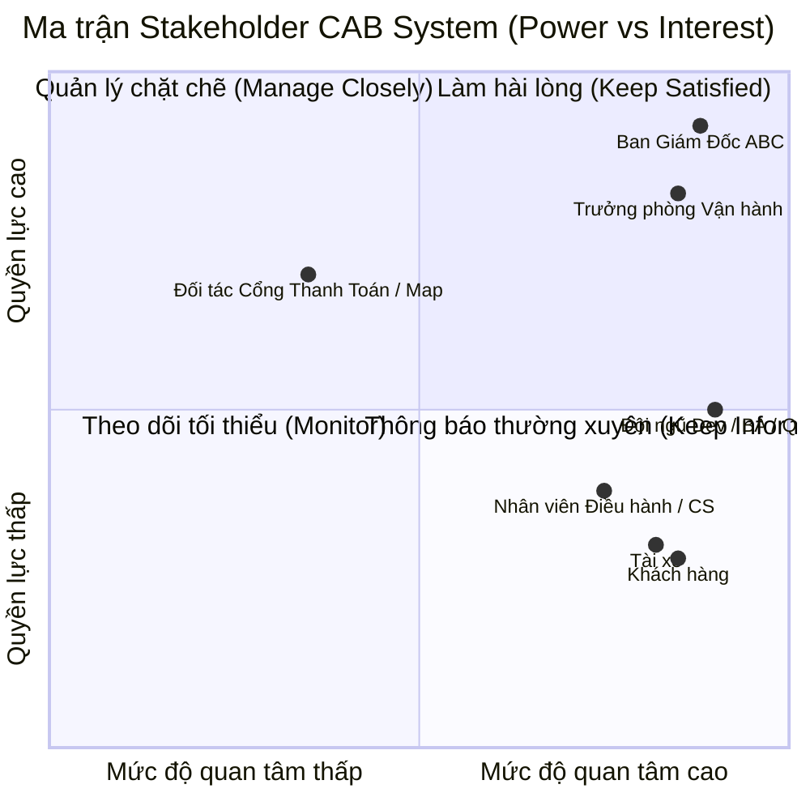
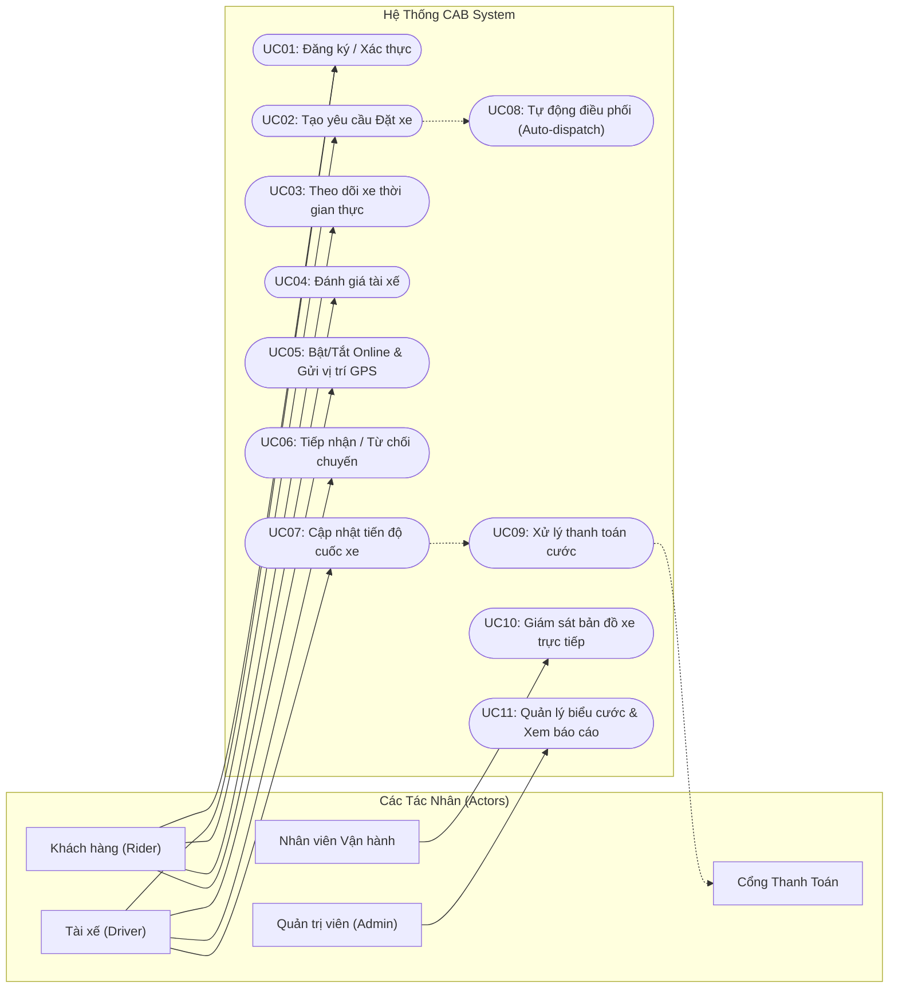
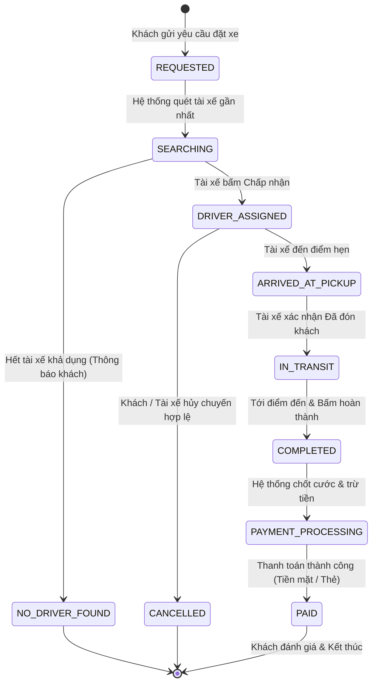
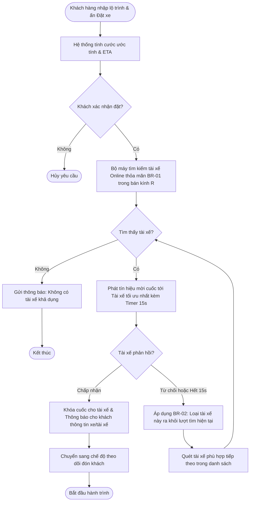
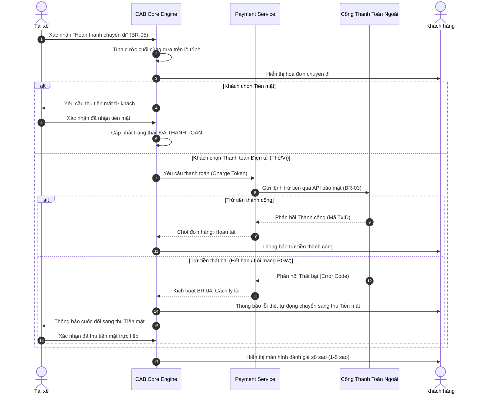

# BÁO CÁO ĐẶC TẢ YÊU CẦU PHẦN MỀM (SRS)
## ĐỀ TÀI: NỀN TẢNG ĐẶT XE TRỰC TUYẾN - CAB SYSTEM
- **Đơn vị đầu tư:** Công ty Cổ phần Vận tải ABC
- **Thời hạn triển khai:** 7 tuần (Triển khai phiên bản MVP)
- **Phương pháp luận:** Kỹ nghệ Yêu cầu Phần mềm (Software Requirements Engineering / BABOK Lifecycle)

---

## BƯỚC 1: XÁC ĐỊNH PHẠM VI DỰ ÁN & MỤC TIÊU KINH DOANH (PROJECT SCOPE & OBJECTIVES)

### 1.1 Vấn đề tồn đọng của hiện trạng (Problem Statement)
- **Điều phối thủ công:** Tổng đài viên và ứng dụng sơ khai gán cuốc thủ công gây tắc nghẽn, chậm trễ trong giờ cao điểm.
- **Trải nghiệm thiếu minh bạch:** Khách hàng không theo dõi được vị trí tài xế theo thời gian thực (real-time tracking), không rõ thời gian dự kiến đón (ETA).
- **Quản lý dữ liệu phân tán:** Thông tin chuyến đi, cước phí và thanh toán chưa được đồng bộ tập trung, tiềm ẩn rủi ro sai lệch tài chính.
- **Khả năng mở rộng hạn chế:** Hệ thống cũ không hỗ trợ mở rộng thêm phương thức thanh toán, loại dịch vụ xe mới hoặc chịu tải đột biến.

### 1.2 Mục tiêu dự án (Business Objectives)
- Xây dựng nền tảng CAB System tự động hóa 100% quy trình: Đặt xe $
ightarrow$ Điều phối $
ightarrow$ Di chuyển $
ightarrow$ Tính cước $
ightarrow$ Thanh toán $
ightarrow$ Đánh giá.
- Rút ngắn thời gian gán tài xế xuống dưới 3 giây bằng thuật toán tự động.
- Triển khai và bàn giao phiên bản MVP hoạt động ổn định trong **7 tuần**.

---

## BƯỚC 2: PHÂN TÍCH CÁC BÊN LIÊN QUAN & MA TRẬN STAKEHOLDER (STAKEHOLDER MATRIX)

### 2.1 Bảng phân tích chi tiết Stakeholders
| Nhóm Stakeholder | Vai trò trong hệ thống | Kỳ vọng / Mục tiêu cốt lõi | Quyền lực (Power) | Mức độ quan tâm (Interest) |
| :--- | :--- | :--- | :---: | :---: |
| **Ban Giám Đốc ABC** | Chủ đầu tư (Sponsor) | Dự án kịp tiến độ 7 tuần, có khả năng mở rộng, báo cáo doanh thu & tỷ lệ hủy minh bạch. | Rất cao | Rất cao |
| **Trưởng phòng Vận hành** | Quản lý nghiệp vụ (Business Owner) | Giám sát toàn diện xe trên tuyến, phân quyền rõ ràng, hỗ trợ can thiệp cuốc lỗi tức thời. | Cao | Rất cao |
| **Khách hàng (Rider)** | Người dùng dịch vụ | Đặt xe nhanh chóng, cước phí rõ ràng, tài xế đón đúng giờ, an toàn. | Thấp | Rất cao |
| **Tài xế (Driver)** | Đối tác cung cấp dịch vụ | Nhận cuốc công bằng, giao diện 1-chạm an toàn khi lái xe, thu nhập rõ ràng. | Thấp | Rất cao |
| **Nhân viên Vận hành / CS** | Người vận hành tác nghiệp | Giao diện điều phối trực quan, tra cứu sự cố tức thì, thao tác nhanh. | Thấp | Cao |
| **Đối tác PGW / Map / Push** | Bên cung cấp hạ tầng thứ ba | Tích hợp đúng chuẩn API, bảo mật thông tin tài khoản thẻ theo chuẩn SLA. | Cao | Vừa |

### 2.2 Ma trận Phân tích Stakeholder (Mermaid Quadrant Chart)

---

## BƯỚC 3: XÁC ĐỊNH CÁC TÁC NHÂN HỆ THỐNG (SYSTEM ACTORS)

1. **Khách hàng (Customer / Rider):** Người đăng ký tài khoản, gửi yêu cầu đặt xe, theo dõi vị trí xe, thanh toán và đánh giá cuốc xe.
2. **Tài xế (Driver):** Đối tác nhận chuyến, cập nhật trạng thái di chuyển (Đã đến điểm đón $
ightarrow$ Đã đón khách $
ightarrow$ Hoàn thành), truyền tọa độ GPS định kỳ.
3. **Nhân viên Vận hành (Operations Staff):** Giám sát trạng thái xe trên bản đồ, hỗ trợ giải quyết sự cố, tra cứu lịch sử giao dịch.
4. **Quản trị viên (Admin):** Quản trị danh mục xe/tài xế, cấu hình biểu giá cước, quản lý phân quyền RBAC và trích xuất báo cáo kinh doanh.
5. **Cổng thanh toán bên ngoài (External Payment Gateway):** Hệ thống của bên thứ ba xử lý giao dịch trừ tiền thẻ/ví điện tử.
6. **Dịch vụ Bản đồ & Định vị (Map & Routing Service):** Cung cấp API tính lộ trình, gợi ý địa chỉ và ước tính khoảng cách/thời gian di chuyển.

---

## BƯỚC 4: CÁC QUY TẮC NGHIỆP VỤ (BUSINESS RULES - BR)
*Hệ thống bắt buộc tuân thủ 5 quy tắc nghiệp vụ bất biến sau:*

- **BR-01 (Điều kiện sẵn sàng của tài xế):** Tài xế chỉ được nhận tín hiệu cuốc xe mới khi thỏa mãn đồng thời: (1) Tài khoản đang ở trạng thái kích hoạt, (2) Đã bật chế độ `Online`, (3) Không đang trong bất kỳ hành trình nào (`Active Trip = False`).
- **BR-02 (Cơ chế chuyển tiếp đơn cuốc - Failover Sequential Dispatch):** Mỗi cuốc xe chỉ được chuyển tới **duy nhất 01 tài xế** tối ưu nhất tại một thời điểm. Nếu tài xế chủ động ấn "Từ chối" hoặc không bấm phản hồi trong thời gian quy định (15 giây), hệ thống tự động loại tài xế này và chuyển tiếp cuốc xe đến tài xế phù hợp tiếp theo mà không yêu cầu khách hàng đặt lại.
- **BR-03 (Bảo vệ thông tin tài chính nhạy cảm):** Hệ thống CAB tuyệt đối không lưu trữ số thẻ tín dụng (PAN), ngày hết hạn hay mã CVV/CVC trên máy chủ nội bộ. Toàn bộ thông tin thẻ được xử lý qua cơ chế Token hóa (Tokenization) từ Cổng thanh toán được cấp phép.
- **BR-04 (Cách ly lỗi thanh toán điện tử):** Nếu giao dịch qua cổng thanh toán trực tuyến bị lỗi hoặc từ chối, hệ thống không được hủy chuyến đi mà tự động kích hoạt phương thức thanh toán tiền mặt dự phòng và gửi thông báo cho cả tài xế và khách hàng.
- **BR-05 (Điều kiện đóng cuốc xe):** Tài xế chỉ được bấm "Hoàn thành chuyến" khi tọa độ xe nằm trong bán kính cho phép của điểm đến (sai số tối đa 150m) hoặc có sự can thiệp xác nhận đặc biệt từ bộ phận Vận hành.

---

## BƯỚC 5: YÊU CẦU NGHIỆP VỤ (BUSINESS REQUIREMENTS)

- **BRQ-01 (Yêu cầu Đặt xe & Theo dõi):** Hệ thống phải cho phép khách hàng đặt xe theo loại dịch vụ mong muốn, nhận diện được trạng thái tìm kiếm, biết thông tin tài xế tiếp nhận và theo dõi di chuyển thời gian thực.
- **BRQ-02 (Yêu cầu Tự động phân công tài xế):** Hệ thống phải tự động quét, xếp hạng và gán tài xế gần nhất theo thuật toán tuần tự, đảm bảo không bỏ sót yêu cầu của khách hàng khi tài xế từ chối.
- **BRQ-03 (Yêu cầu Quản lý hành trình di chuyển):** Cung cấp cơ chế cập nhật trạng thái hành trình theo thời gian thực cho tài xế với thao tác 1-chạm, đồng bộ ngay lập tức sang ứng dụng của khách hàng.
- **BRQ-04 (Yêu cầu Tính cước & Thanh toán đa kênh):** Tự động tính cước minh bạch dựa trên dữ liệu hành trình thực tế, hỗ trợ linh hoạt cả tiền mặt và ví điện tử/thẻ ngân hàng.
- **BRQ-05 (Yêu cầu Thông báo sự kiện tức thời):** Tự động bắn thông báo đẩy (Push notification) tới đúng đối tượng tại từng mốc sự kiện quan trọng của cuốc xe.
- **BRQ-06 (Yêu cầu Giám sát vận hành & Báo cáo tổng hợp):** Cung cấp bảng điều khiển quản trị trung tâm để theo dõi các chuyến đi đang chạy, quản lý phương tiện/tài xế và trích xuất báo cáo doanh thu, tỷ lệ hoàn thành, tỷ lệ hủy.

---

## BƯỚC 6: MÔ HÌNH HÓA NGHIỆP VỤ (BUSINESS PROCESS MODELING)

### 6.1 Sơ đồ Tổng quan Use Case Hệ thống (System Use Case Diagram)

### 6.2 Mô hình Vòng đời Trạng thái Cuốc xe (State Transition Diagram)

### 6.3 Sơ đồ Hoạt động Nghiệp vụ: Đặt xe & Tự động điều phối (Activity Diagram)

### 6.4 Sơ đồ Tuần tự Nghiệp vụ Thanh toán & Cách ly lỗi (Sequence Diagram)

---

## BƯỚC 7: YÊU CẦU CHỨC NĂNG CHI TIẾT (FUNCTIONAL REQUIREMENTS - FR)
*(Chi tiết hóa kỹ thuật các chức năng phần mềm mà lập trình viên và kiểm thử viên cần phát triển, được ánh xạ từ các mô hình nghiệp vụ ở Bước 6)*

### 7.1 Phân hệ Khách hàng (Customer Subsystem - FR-CUS)
| Mã FR | Tên chức năng | Mô tả chi tiết kỹ thuật | Quy tắc ràng buộc / BR |
| :--- | :--- | :--- | :--- |
| **FR-CUS-01** | Đăng ký & Xác thực | Cho phép khách đăng ký tài khoản qua Số điện thoại, gửi mã OTP xác thực SMS. Đăng nhập qua Mật khẩu/OTP. | Chuẩn PII |
| **FR-CUS-02** | Chọn lộ trình di chuyển | Nhập điểm đón và điểm đến. Tích hợp Map Autocomplete để gợi ý địa chỉ chính xác kèm tọa độ GPS (Lat/Long). | Map API |
| **FR-CUS-03** | Lựa chọn loại xe & Xem cước | Hiển thị các hạng xe (4 chỗ, 7 chỗ). Tính và hiển thị trước: Giá cước ước tính, khoảng cách (km) và thời gian đón (ETA). | BRQ-01 |
| **FR-CUS-04** | Gửi yêu cầu Đặt xe | Khách ấn "Đặt xe", hệ thống tạo bản ghi chuyến đi với trạng thái `SEARCHING` và chuyển tiếp sang Bộ máy điều phối. | BR-01, BR-02 |
| **FR-CUS-05** | Theo dõi tài xế thời gian thực | Khi có tài xế nhận cuốc, hiển thị: Họ tên tài xế, ảnh đại diện, số điện thoại, biển số xe, dòng xe và icon xe di chuyển trên bản đồ. | BRQ-01 |
| **FR-CUS-06** | Hủy chuyến đi | Cho phép khách hủy chuyến khi xe đang tìm hoặc trước khi tài xế đến điểm đón theo chính sách hủy. | Cancellation Policy |
| **FR-CUS-07** | Lịch sử chuyến đi | Xem danh sách các chuyến đi trong quá khứ, chi tiết hóa đơn (giá mở cửa, quãng đường, thời gian) và lộ trình đã đi. | BRQ-04 |
| **FR-CUS-08** | Đánh giá & Phản hồi | Cho phép khách chấm điểm từ 1 đến 5 sao và để lại nhận xét sau khi cuốc xe hoàn tất. | BRQ-01 |

### 7.2 Phân hệ Tài xế (Driver Subsystem - FR-DRI)
| Mã FR | Tên chức năng | Mô tả chi tiết kỹ thuật | Quy tắc ràng buộc / BR |
| :--- | :--- | :--- | :--- |
| **FR-DRI-01** | Đăng ký & Quản lý hồ sơ | Tài xế đăng ký thông tin cá nhân, chụp tải lên bằng lái xe, đăng kiểm, bảo hiểm xe; chờ phê duyệt từ Admin. | BRQ-06 |
| **FR-DRI-02** | Bật/Tắt trạng thái làm việc | Cung cấp nút gạt trạng thái: Chuyển đổi giữa `Online` (sẵn sàng nhận cuốc) và `Offline` (nghỉ ngơi). | BR-01 |
| **FR-DRI-03** | Gửi tọa độ GPS thời gian thực | Ứng dụng chạy nền ngầm định kỳ 3-5 giây/lần gửi tọa độ vị trí hiện tại về Location Service khi đang Online. | NFR-01 |
| **FR-DRI-04** | Tiếp nhận thông báo cuốc xe | Nhận màn hình pop-up cảnh báo cuốc mới: Điểm đón, điểm đến, khoảng cách tới khách, kèm nút Chấp nhận/Từ chối và bộ đếm ngược 15 giây. | BR-02 |
| **FR-DRI-05** | Cập nhật tiến độ cuốc xe | Cung cấp giao diện 1 chạm cập nhật trạng thái di chuyển: (1) Đã đến điểm đón $
ightarrow$ (2) Đã đón khách $
ightarrow$ (3) Hoàn thành chuyến. | BR-05 |
| **FR-DRI-06** | Xác nhận thanh toán tiền mặt | Trường hợp khách trả tiền mặt, màn hình tài xế hiển thị số tiền chính xác cần thu và nút xác nhận "Đã nhận đủ tiền mặt". | BRQ-04 |

### 7.3 Phân hệ Điều phối & Thuật toán tìm xe (Matching & Dispatching - FR-DIS)
| Mã FR | Tên chức năng | Mô tả chi tiết kỹ thuật | Quy tắc ràng buộc / BR |
| :--- | :--- | :--- | :--- |
| **FR-DIS-01** | Quét tài xế lân cận | Thuật toán truy vấn danh sách tài xế trong bán kính $R$ (3-5km) thỏa mãn: Đang Online, Đang rảnh rỗi (`Idle`), đúng loại xe yêu cầu. | BR-01 |
| **FR-DIS-02** | Xếp hạng ưu tiên tài xế | Sắp xếp tài xế tìm được theo độ ưu tiên: Khoảng cách di chuyển tới điểm đón ngắn nhất + Điểm đánh giá (Rating) cao nhất. | BRQ-02 |
| **FR-DIS-03** | Chuyển tiếp cuốc xe tự động | Gửi lời mời tới tài xế top 1. Nếu tài xế từ chối hoặc hết 15 giây (Timeout), tự động loại trừ và đẩy lời mời tới tài xế top 2 mà không bắt khách tạo lại chuyến. | BR-02 |
| **FR-DIS-04** | Xử lý khi không có tài xế | Khi hết danh sách tài xế khả dụng hoặc quá thời gian tìm kiếm tổng (ví dụ 60 giây), tự động chuyển trạng thái `NO_DRIVER_FOUND` và thông báo cho khách. | BRQ-02 |

### 7.4 Phân hệ Tính cước & Thanh toán (Fare & Payment - FR-PAY)
| Mã FR | Tên chức năng | Mô tả chi tiết kỹ thuật | Quy tắc ràng buộc / BR |
| :--- | :--- | :--- | :--- |
| **FR-PAY-01** | Công thức tính cước tự động | Tính cước khi kết thúc chuyến: `Tổng tiền = Cước mở cửa + (Khoảng cách thực tế x Đơn giá/km) + (Thời gian chạy x Đơn giá/phút)`. | BRQ-04 |
| **FR-PAY-02** | Tích hợp Cổng thanh toán (PGW) | Kết nối API cổng thanh toán (VNPay / MoMo / Stripe) qua giao thức an toàn để trừ tiền tự động bằng Token đã lưu. | BR-03 |
| **FR-PAY-03** | Bảo mật không lưu thông tin thẻ | Không lưu PAN/CVV vào database; chỉ lưu định danh thanh toán `Payment_Token_ID` do PGW cấp. | BR-03 |
| **FR-PAY-04** | Cơ chế cách ly lỗi thanh toán | Nếu PGW trả về mã lỗi hoặc timeout: Hệ thống không hủy cuốc, lập tức đổi trạng thái sang thanh toán Tiền mặt và gửi thông báo cho tài xế thu trực tiếp. | BR-04 |

### 7.5 Phân hệ Thông báo Đa kênh (Notification Subsystem - FR-NOT)
| Mã FR | Tên chức năng | Mô tả chi tiết kỹ thuật | Quy tắc ràng buộc / BR |
| :--- | :--- | :--- | :--- |
| **FR-NOT-01** | Bắn Push Notification tự động | Tự động gửi thông báo đẩy đến Khách hàng và Tài xế theo từng sự kiện: Tìm thấy xe, Xe đã đến điểm đón, Đón khách, Hoàn thành, Trừ tiền. | BRQ-05 |
| **FR-NOT-02** | Kiến trúc mở rộng kênh thông báo | Thiết kế theo Adapter Pattern cho phép dễ dàng tích hợp thêm các kênh SMS, Zalo ZNS hoặc WhatsApp trong tương lai mà không sửa đổi Core. | BRQ-05 |

### 7.6 Phân hệ Quản trị & Vận hành (Operations & Admin Portal - FR-OPS)
| Mã FR | Tên chức năng | Mô tả chi tiết kỹ thuật | Quy tắc ràng buộc / BR |
| :--- | :--- | :--- | :--- |
| **FR-OPS-01** | Giám sát cuốc xe trực tiếp | Bản đồ tương tác trực quan hiển thị toàn bộ xe đang hoạt động, danh sách cuốc xe theo thời gian thực (Đang chờ, Đang chạy, Sự cố). | BRQ-06 |
| **FR-OPS-02** | Quản lý Tài khoản & Phương tiện | Phê duyệt hồ sơ đối tác tài xế mới, khóa tạm thời tài khoản vi phạm chính sách, quản lý thông tin kiểm định xe. | BRQ-06 |
| **FR-OPS-03** | Phân quyền truy cập theo vai trò (RBAC) | Cấu hình quyền: (1) `Admin` toàn quyền, (2) `Dispatcher` giám sát và hỗ trợ cuốc lỗi, (3) `Support` chỉ xem lịch sử giải đáp khiếu nại. | RBAC Rule |
| **FR-OPS-04** | Báo cáo & Thống kê kinh doanh | Trích xuất báo cáo: Doanh thu theo thời gian, Tổng số chuyến, Tỷ lệ cuốc hoàn thành, Tỷ lệ cuốc hủy (phân loại hủy do khách/tài xế), Hiệu suất tài xế. | BRQ-06 |

---

## BƯỚC 8: YÊU CẦU PHI CHỨC NĂNG (NON-FUNCTIONAL REQUIREMENTS)

- **NFR-01 (Hiệu năng & Thời gian đáp ứng):** Thời gian phát cuốc tới tài xế đầu tiên không quá 3 giây. Thời gian tải bản đồ và tọa độ phản hồi dưới 1 giây.
- **NFR-02 (Tính chịu lỗi & Cách ly sự cố):** Khi Cổng thanh toán hoặc dịch vụ Push Notification bên thứ ba gặp sự cố gián đoạn, dịch vụ điều phối chuyến đi vẫn phải hoạt động độc lập và không bị gián đoạn.
- **NFR-03 (Khả năng mở rộng):** Kiến trúc hệ thống thiết kế dạng Modular để dễ dàng tích hợp thêm các dịch vụ mới (giao hàng, loại xe mới) hoặc đổi nhà cung cấp bản đồ mà không phải viết lại mã nguồn cốt lõi.
- **NFR-04 (Bảo mật & Phân quyền):** Áp dụng mã hóa HTTPS/TLS cho đường truyền, cơ chế phân quyền RBAC cho nhân viên vận hành và ghi log kiểm toán bất biến cho các hành vi thay đổi cước hoặc chỉnh sửa trạng thái cuốc.

---

## BƯỚC 9: DANH MỤC VẤN ĐỀ CẦN LÀM RÕ VỚI KHÁCH HÀNG (OPEN ISSUES FOR BA)

Trong Tuần 1, Business Analyst cần làm việc với Lãnh đạo Công ty ABC để thống nhất các nội dung sau:
1. **Chi tiết cấu trúc cước:** Công thức cước cố định 2km đầu là bao nhiêu? Đơn giá/km và phụ phí đêm/giờ cao điểm được cấu hình động ra sao?
2. **Quy định phạt tài xế:** Tài xế không phản hồi/từ chối bao nhiêu cuốc liên tiếp thì bị hạ điểm uy tín hoặc khóa tài khoản tạm thời?
3. **Chính sách hủy chuyến:** Thời gian hủy miễn phí là bao nhiêu phút sau khi xe nhận? Phí hủy cuốc (nếu có) được tính và trừ vào tài khoản khách bằng cách nào?
4. **Xử lý mất kết nối mạng:** Cơ chế lưu đệm tọa độ ngoại tuyến trên thiết bị tài xế và gửi bù tọa độ khi có lại sóng 4G.
5. **Thời hạn lưu vết dữ liệu:** Quy định lưu trữ tọa độ GPS chi tiết (đề xuất 30 ngày) và dữ liệu kế toán/giao dịch (đề xuất tối thiểu 5 năm).

---

## BƯỚC 10: KẾ HOẠCH BÀN GIAO 7 TUẦN (7-WEEK GANTT ROADMAP)

